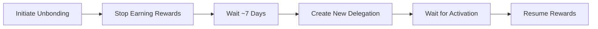
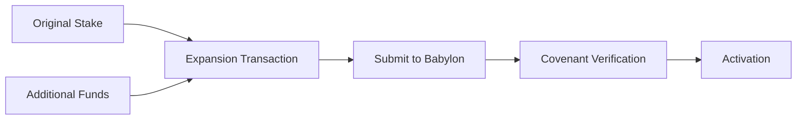

# Bitcoin Stake Expansion

## Table of Contents

1. [Introduction](#1-introduction)
2. [Bitcoin Stake Expansion Methods](#2-bitcoin-stake-expansion-methods)
   1. [Overview of Expansion vs Traditional Unbond-Restake](#21-overview-of-expansion-vs-traditional-unbond-restake)
   2. [Expansion Validation](#22-expansion-validation)
3. [Bitcoin Stake Expansion Registration](#3-bitcoin-stake-expansion-registration)
   1. [Overview of Expansion Data Requirements](#31-overview-of-expansion-data-requirements)
   2. [Babylon Chain BTC Staking Parameters](#32-babylon-chain-btc-staking-parameters)
   3. [Creating the Bitcoin Expansion Transaction](#33-creating-the-bitcoin-expansion-transaction)
   4. [The `MsgBtcStakeExpand` Babylon Message](#34-the-msgbtcstakeexpand-babylon-message)
   5. [Constructing the `MsgBtcStakeExpand`](#35-constructing-the-msgbtcstakeexpand)
4. [Managing your Bitcoin Stake Expansion](#4-managing-your-bitcoin-stake-expansion)
   1. [Monitoring Expansion Status](#41-monitoring-expansion-status)
   2. [Activation Process](#42-activation-process)

---

This document walks through the process of expanding existing Bitcoin stakes on the Babylon chain. Bitcoin Stake Expansion allows existing active delegations to add new finality providers, increase staking amounts, or extend timelock periods without requiring the traditional unbonding process.

**Target Audience**: This document is intended as a reference for technical readers implementing Bitcoin stake expansion functionality in staking platforms, wallet integrations, or custom Bitcoin staking solutions.

## 1. Introduction

Bitcoin Stake Expansion enables existing active BTC delegations to be modified and extended without the approximately 7-day unbonding period. This process maintains continuous reward earning and voting power while allowing stakers to:

- **Add New Finality Providers**: Extend security to additional BSNs by delegating to new finality providers
- **Increase Staking Amount**: Add more BTC to existing stakes using additional funding UTXOs  
- **Extend Timelock Periods**: Renew or extend the staking duration

**Key Benefits:**
- Zero downtime for voting power and rewards
- No unbonding fees or waiting periods  
- Atomic activation process
- Maintains security guarantees throughout expansion

## 2. Bitcoin Stake Expansion Methods

### 2.1 Overview of Expansion vs Traditional Unbond-Restake

**Traditional Multi-Chain Staking Flow:**



**Stake Expansion Flow:**


> **⚡ Note**: Expansion maintains reward earning throughout the entire process, only transitioning atomically upon final activation.

### 2.2 Expansion Requirements

**Key Requirements for Expansion:**
- Original delegation must be `ACTIVE` with no ongoing unbonding or slashing
- Expansion transaction must have exactly 2 inputs: original stake output + funding UTXO
- Funding UTXO must be from a separate, confirmed Bitcoin transaction controlled by your staking key
- New finality provider list must include all existing FPs (can only add, not remove)
- New staking amount must be ≥ original amount
- All transactions must use current Babylon staking parameters

> **⚠️ Critical**: Create a separate funding transaction first, wait for confirmation, then use that UTXO as Input 1 in your expansion transaction. Expansion transactions are limited to exactly 2 inputs.

## 3. Bitcoin Stake Expansion Registration

### 3.1 Overview: What You Need for Expansion

To expand a Bitcoin stake, you need to submit a `MsgBtcStakeExpand` message containing:

1. **Reference to your original stake** - Transaction hash of your active delegation
2. **Funding preparation** - A confirmed Bitcoin transaction with additional funds
3. **Expansion transaction** - A special 2-input Bitcoin transaction combining original stake + new funds
4. **Updated delegation parameters** - New finality providers (superset), amounts, timelock
5. **Security signatures** - Proof of key ownership and pre-signed slashing consent

**High-Level Process:**



### 3.2 Step-by-Step Expansion Process

#### Step 1: Gather Your Original Delegation Data

**What you need:** Transaction hash and details of your active stake

**How to get it:**
```bash
# Find your active delegations
babylond query btcstaking delegations-by-staker [your-babylon-address]
```

**Extract from the response:**
- `staking_tx_hash` - This becomes your `previous_staking_tx_hash`
- Current finality provider list - Must be included in expansion
- Original staking amount - New amount must be ≥ this value

#### Step 2: Create a Funding Transaction

**What you need:** A confirmed Bitcoin transaction with additional funds

**How to create it:**
1. Create a standard Bitcoin transaction sending funds to an address controlled by your staking Bitcoin key
2. Broadcast it to Bitcoin network and wait for confirmation
3. Record the transaction hash and output index (vout) of your funding UTXO

**Critical:** This MUST be a separate, confirmed transaction before creating the expansion transaction.

#### Step 3: Get Current Staking Parameters

**What you need:** Current Babylon staking parameters for validation

**How to get them:**
```bash
# Get current parameters
babylond query btcstaking params

# Get Bitcoin light client tip (for parameter selection)
babylond query btclightclient tip
```

**Key parameters needed:**
- `covenant_pks`, `covenant_quorum` - For staking script construction
- `slashing_pk_script`, `slashing_rate` - For slashing transactions
- `min_staking_value_sat`, `max_staking_value_sat` - Value bounds
- `unbonding_time_blocks` - For unbonding transactions

#### Step 4: Build the Expansion Transaction

**What you need:** A Bitcoin transaction with exactly 2 inputs, 1 output

**Structure:**
- **Input 0:** Your original staking transaction output
- **Input 1:** The funding UTXO from Step 2
- **Output 0:** New expanded staking output

**How to construct:** Use Bitcoin staking libraries or follow the [staking script specification](./staking-script.md)

#### Step 5: Create Slashing Transactions

**What you need:** Pre-signed transactions consenting to slashing

**Required transactions:**
- `slashing_tx` - Spends expanded staking output if FPs double-sign
- `unbonding_slashing_tx` - Spends expanded unbonding output if FPs double-sign
- Corresponding BIP-340 signatures for both transactions

**How to create:** Use current `slashing_pk_script` and `slashing_rate` from Step 3

#### Step 6: Prepare Additional Required Data

**Proof of Possession (PoP):**
- Sign your Babylon staker address with your Bitcoin private key
- Use same key as original delegation

**Expanded Finality Provider List:**
- Start with original FP list from Step 1
- Add any new finality provider public keys (32-byte BIP-340 format)
- Final list must be a superset of original (cannot remove FPs)

**Unbonding Transaction:**
- Transaction that spends expanded staking output via unbonding path
- Uses `unbonding_time_blocks` from current parameters

#### Step 7: Submit the Expansion

**What you need:** All data from previous steps assembled into `MsgBtcStakeExpand`

**How to submit:**
```bash
babylond tx btcstaking btc-stake-expand [all-required-fields]
```

Or use Golang/TypeScript libraries to construct and broadcast the message.

### 3.3 Critical Requirements and Common Issues

#### Understanding UTXO Requirements

**Most Common Failure Point:** Incorrect UTXO handling

**The Rule:** Expansion transactions must have exactly 2 inputs in this order:
1. **Input 0:** Original staking transaction output
2. **Input 1:** Additional funding UTXO (from your confirmed funding transaction)

**Common Mistakes:**
- ❌ Using more than 2 inputs
- ❌ Using Input 1 from an unconfirmed transaction
- ❌ Using Input 1 controlled by a different Bitcoin key
- ❌ Wrong input order

#### Transaction Signing Process

**Input 0 (Original Stake):**
- Requires covenant signatures (obtained from Babylon node)
- Query: `babylond query btcstaking btc-delegation [previous-staking-tx-hash]`
- Look for `StkExp` field containing pre-computed covenant signatures

**Input 1 (Funding UTXO):**
- Standard Bitcoin signing with your staking private key
- Same key used for original delegation

### 3.4 Babylon Chain BTC Staking Parameters

BTC Stake expansions must adhere to parameters defined by the Babylon chain,
which vary based on Bitcoin block heights. Each parameters version
is defined by a `btc_activation_height`, determining the Bitcoin height
from which the parameters version takes effect.

For expansion transactions, you must determine the applicable parameter version 
based on the **current Babylon on-chain Bitcoin light client tip height** 
at the time of expansion registration. This ensures that the expansion transaction 
commits to be validated against the current staking parameters version, similar 
to the pre-staking registration flow.

To determine the correct parameters for expansion:
1. Query the current Bitcoin light client tip height on Babylon:
   ```bash
   babylond query btclightclient tip
   ```
2. Use this height as the `lookup_btc_height` to find the applicable parameters
3. Sort all parameters versions by `btc_activation_height` in ascending order
4. The first parameters version with `lookup_btc_height >= btc_activation_height`
   applies to the expansion

**Key Expansion Staking Parameters:**

* `covenant_pks`:
  BIP-340 public keys of the covenant committee (64-character hex strings).
  The public keys are an x-coordinate only representation of a secp256k1 curve point.
  These are required for constructing the expansion staking script and slashing transactions.

* `covenant_quorum`:
  The minimum number of covenant signatures required for transaction validation.
  The expansion will be verified once this quorum threshold is met.

* `min_staking_value_sat` / `max_staking_value_sat`:
  The minimum/maximum Bitcoin stake in satoshis. The expansion's total `staking_value`
  must fall within these bounds and be greater than or equal to the original stake amount.

* `min_staking_time_blocks` / `max_staking_time_blocks`:
  The minimum/maximum Bitcoin staking duration (in Bitcoin blocks).
  The expansion's `staking_time` must comply with these constraints.

* `slashing_pk_script`:
  The `pk_script` expected in the first output of slashing transactions.
  This must be used when constructing both the staking and unbonding slashing
  transactions for the expansion.

* `min_slashing_tx_fee_sat`:
  The minimum transaction fee (in satoshis) required for the pre-signed slashing
  transactions. Both expansion slashing transactions must meet this requirement.

* `slashing_rate`: 
  A scalar specifying the percentage of stake slashed if finality providers double-sign.
  This affects the slashing transaction output amounts.

* `unbonding_time_blocks`:
  The on-demand unbonding time in Bitcoin blocks that must be used for the
  expansion's unbonding transaction timelock.

* `unbonding_fee_sat`:
  The Bitcoin fee in satoshis required for unbonding transactions.
  The expansion unbonding transaction must account for this fee.

* `min_commission_rate`: 
  A scalar defining the minimum commission rate for finality providers.
  All finality providers in the expansion list must meet this requirement.

* `delegation_creation_base_gas_fee`: 
  Defines the minimum gas fee required when registering a stake expansion.
  Since expansions follow the pre-staking pattern, this increased gas fee applies.

* `btc_activation_height`: 
  The Bitcoin block height on which this parameters version takes effect.

> **⚡ Retrieving Current Staking Parameters**
>
> These parameters are part of the [x/btcstaking](../x/btcstaking)
> module and can be queried via a Babylon node using RPC/LCD endpoints or the CLI:
>
> ```bash
> # Query current staking parameters
> babylond query btcstaking params
> 
> # Query specific parameter version by Bitcoin height
> babylond query btcstaking params --height [bitcoin-height]
> 
> # Query Bitcoin light client tip for parameter selection
> babylond query btclightclient tip
> ```

> **⚠️ Critical Warning**: Make sure that you are retrieving the BTC Staking 
> parameters from a trusted node and verify their authenticity using additional
> sources. Using incorrect parameters will cause expansion validation to fail
> or create transactions incompatible with the current Babylon state.

> **⚡ Parameter Selection for Expansion**
>
> Unlike post-staking registration which uses parameters based on Bitcoin
> inclusion height, expansions must use parameters corresponding to the
> **current Babylon Bitcoin light client tip** at expansion submission time.
> This pre-commitment ensures parameter consistency even if the expansion
> is later included in a Bitcoin block with different active parameters.

### 3.5 Detailed Transaction Construction

The Bitcoin expansion transaction and related transactions must follow the specific 
structures required by the btcstaking module. These transactions include:
* **Bitcoin Expansion Transaction**: The main transaction that spends the original 
  stake and additional funding to create the expanded stake
* **Slashing Transaction**: A pre-signed transaction consenting to slashing 
  in case of double-signing for the expanded stake
* **Unbonding Transaction**: The on-demand unbonding transaction used to unlock 
  the expanded stake before the originally committed timelock expires
* **Unbonding Slashing Transaction**: A pre-signed transaction consenting to 
  slashing during the unbonding process in case of double-signing

#### Creating the Bitcoin Expansion Transaction

The expansion transaction must follow a strict two-input structure validated 
by the btcstaking module:

**Required Transaction Structure:**
- **Input 0**: Previous staking transaction output (the original active delegation)
  * Must reference the exact UTXO from the original staking transaction
  * Requires covenant signatures for spending (obtained from Babylon node)
  * Must match the `previous_staking_tx_hash` provided in the expansion message
- **Input 1**: Additional funding UTXO (controlled by staker)
  * Must be controlled by the same Bitcoin key used for staking
  * Provides funds for staking value increase and transaction fees
  * Must be from a confirmed Bitcoin transaction (the `funding_tx`)
- **Output 0**: New expanded staking output
  * Must follow the [staking script format](./staking-script.md) exactly
  * Uses the expanded finality provider list (superset of original)
  * Contains the new total staking value (≥ original amount)
  * Must use current Babylon staking parameters

#### Critical: Signing the Expansion Transaction

**The expansion transaction signing process is different from regular Bitcoin transactions** because Input 0 (the original staking output) requires covenant signatures to be spent through the unbonding path.

**Step-by-Step Signing Process:**

1. **Retrieve Covenant Signatures from Babylon Node**:
   ```bash
   # Query the original delegation to get covenant signatures
   babylond query btcstaking btc-delegation [previous-staking-tx-hash]
   ```
   
   The response includes a `StkExp` (StakeExpansionResponse) field containing the covenant signatures needed to spend the original staking output. These signatures are pre-computed by the covenant committee for expansion purposes.

2. **Create the Staker Signature for Input 1**:
   - Sign Input 1 (funding UTXO) using your Bitcoin private key
   - This follows standard Bitcoin signing procedures (legacy or SegWit depending on UTXO type)

3. **Compose the Transaction Witness**:
   - **Input 0 Witness**: Combine the covenant signatures (from step 1) with your staker signature to create the witness stack for spending the original staking output via unbonding path
   - **Input 1 Witness**: Your signature for spending the funding UTXO

4. **Finalize and Broadcast**:
   - The fully signed expansion transaction can now be broadcast to the Bitcoin network
   - Submit the transaction hash and inclusion proof to Babylon after confirmation

**Important Signature Details:**

- **Input 0 (Original Staking Output)**:
  - Spends via **unbonding path** of the staking script
  - Requires: Staker signature + Covenant signatures (quorum)
  - Covenant signatures are **provided by Babylon node** in delegation response
  - Staker must sign with the same Bitcoin key used for original stake

- **Input 1 (Funding UTXO)**:
  - Spends via normal Bitcoin script (P2PKH, P2WPKH, etc.)
  - Requires: Only staker signature
  - Must use same Bitcoin key as staking key for consistency

**Common Signing Mistakes:**
- ❌ Trying to create covenant signatures yourself - they must come from Babylon node
- ❌ Using wrong signing path for Input 0 - must use unbonding path, not timelock path
- ❌ Missing covenant signatures in witness - transaction will be invalid
- ❌ Using different Bitcoin keys for Input 0 and Input 1 - must be the same key

> **⚡ Note**: The covenant signatures for expansion are pre-computed and stored with each active delegation. You don't need to wait for new covenant signatures - they're immediately available when you query the delegation.

**Input Requirements:**
The expansion transaction inputs must be constructed carefully:

1. **Input 0 (Original Stake)**:
   * `previous_output`: Reference to the original staking transaction output
     * `txid`: Transaction hash of the original staking transaction  
     * `vout`: Output index of the staking output (typically 0)
   * `script_sig`: Initially empty (signatures added during covenant verification)
   * `sequence`: Set according to Bitcoin transaction requirements

2. **Input 1 (Funding UTXO)**:
   * `previous_output`: Reference to the funding transaction output
     * `txid`: Transaction hash from the `funding_tx`
     * `vout`: Output index containing the funding amount
   * `script_sig`: Signature spending the funding UTXO (if legacy input)
   * `witness`: Witness data for spending the funding UTXO (if SegWit input)
   * `sequence`: Set according to Bitcoin transaction requirements

**Output Construction:**  
The expansion transaction must create exactly one output:

* **Output 0 (Expanded Staking Output)**:
  * `value`: Total expanded staking amount in satoshis
  * `pk_script`: The staking script constructed using:
    * Staker's Bitcoin public key (same as original)
    * Expanded finality provider list (superset of original)
    * Current covenant committee public keys and quorum
    * New staking timelock period
    * Current unbonding timelock from parameters

#### Creating Slashing Transactions

Both staking and unbonding slashing transactions must be created for the expansion:

**Staking Slashing Transaction:**
* **Input 0**: Spends the expansion staking output via slashing path
  * `previous_output`: References the expansion transaction output
  * `script_sig`: Initially empty (signatures added during verification)
  * Contains placeholder for staker, covenant, and finality provider signatures
* **Output 0**: Slashing output using current `slashing_pk_script`
  * `value`: Calculated based on `slashing_rate` and staking amount
  * `pk_script`: Must match the current `slashing_pk_script` parameter
* **Output 1** (if applicable): Change output
  * `value`: Remaining funds after slashing and fees
  * `pk_script`: Change script following the staking script format

**Unbonding Slashing Transaction:**
* **Input 0**: Spends the unbonding output via slashing path  
  * `previous_output`: References the unbonding transaction output
  * Similar signature structure to staking slashing transaction
* **Outputs**: Same structure as staking slashing transaction

#### Creating the Unbonding Transaction

The unbonding transaction allows on-demand unlock of the expanded stake:

**Transaction Structure:**
* **Input 0**: Spends the expansion staking output via unbonding path
  * `previous_output`: References the expansion transaction output
  * `script_sig`: Initially empty (staker signature added for unbonding)
* **Output 0**: Unbonding output
  * `value`: Expanded staking amount minus unbonding fees
  * `pk_script`: Unbonding script with current `unbonding_time_blocks`

**Transaction Construction:**
You can create these transactions using:
- [The Golang BTC staking library](../btcstaking) with expansion utilities
- [The TypeScript BTC staking library](https://github.com/babylonlabs-io/btc-staking-ts) 
- Your own implementation following the [Bitcoin staking script specification](./staking-script.md)

> **⚡ Note**: All transactions must use the current Babylon staking parameters 
> retrieved from the Bitcoin light client tip height at expansion submission time.

> **⚠️ Critical Warning**: The expansion transaction must spend exactly 2 inputs 
> in the specified order. The btcstaking module's validation will reject 
> non-conforming transactions. Additionally, all transaction fee calculations 
> must account for the minimum fees specified in the staking parameters.

### 3.4 The `MsgBtcStakeExpand` Babylon Message

The `MsgBtcStakeExpand` message in the btcstaking module handles stake expansion registration:

#### Key Fields in `MsgBtcStakeExpand`

```protobuf
// MsgBtcStakeExpand is the message for expanding existing BTC stakes
message MsgBtcStakeExpand {
  option (cosmos.msg.v1.signer) = "staker_addr";
  
  // Standard delegation fields (same as MsgCreateBTCDelegation)
  string staker_addr = 1;
  ProofOfPossessionBTC pop = 2;
  bytes btc_pk = 3;
  repeated bytes fp_btc_pk_list = 4;  // Must be superset of previous FPs
  uint32 staking_time = 5;            // New/extended timelock period  
  int64 staking_value = 6;            // Total new amount (≥ previous)
  bytes staking_tx = 7;               // Expansion transaction
  
  // Slashing transactions for expanded stake
  bytes slashing_tx = 8;
  bytes delegator_slashing_sig = 9;
  uint32 unbonding_time = 10;
  bytes unbonding_tx = 11;
  int64 unbonding_value = 12;
  bytes unbonding_slashing_tx = 13;
  bytes delegator_unbonding_slashing_sig = 14;
  
  // Expansion-specific fields
  string previous_staking_tx_hash = 15;  // Hash of original delegation
  bytes funding_tx = 16;                 // Transaction with funding UTXO
  
  // Note: staking_tx_inclusion_proof omitted (pre-staking flow)
}
```

#### Explanation of Fields

* `staker_addr`:
  A Bech32-encoded Babylon address (`bbn...`) representing the
  staker's Babylon account where staking rewards will be accumulated.
  *This must be the same address that signed the original delegation and 
  must also sign the expansion registration transaction*.

* `pop` (Proof of Possession):
  A cryptographic signature proving that the submitter of the expansion
  registration transaction is the owner of the Bitcoin private key used for staking.
  This must be the same Bitcoin key used in the original delegation being expanded.
  * `btc_sig_type`: Specifies the signature algorithm used.
    The options are:
    * `0` for [BIP-340 (Schnorr Signatures)](https://github.com/bitcoin/bips/blob/master/bip-0340.mediawiki)
    * `1` for [BIP-322 (Generic Signing format)](https://github.com/bitcoin/bips/blob/master/bip-0322.mediawiki)
      * Note that the [simple](https://github.com/bitcoin/bips/blob/master/bip-0322.mediawiki#simple) signature format is used.
    * `2` for [ECDSA (Elliptic Curve Digital Signature Algorithm)](https://github.com/bitcoin/bips/blob/master/bip-0137.mediawiki)
  * `btc_sig`: The signature generated by signing the staker address using the
    chosen algorithm. The verification process differs by algorithm:
  * **BIP-340**: The hash of the staker address bytes should be signed.
  * **BIP-322**: Bytes of the bech32 encoded address should be signed.
  * **ECDSA**: Bytes of the bech32 encoded address should be signed.

* `btc_pk`:
  This Bitcoin `secp256k1` public key of the BTC staker,
  in BIP-340 format (Schnorr signatures). It is a compact, 32-byte
  value derived from the staker's private key. This public key must be
  exactly the same as the one used in the original delegation being expanded,
  as it corresponds to the staker public key used to construct the 
  [staking script](./staking-script.md) used in both the original and expansion
  BTC Staking transactions.

* `fp_btc_pk_list`:
  A list of the `secp256k1` public keys of the finality providers
  (FPs) to which the expanded stake is delegated in BIP-340 format (Schnorr signatures)
  and compact 32-byte representation. **This list must be a superset of the finality
  providers from the original delegation** - you cannot remove existing finality providers,
  only add new ones.
  > **⚠️ Critical Requirement**: The expansion finality provider list must include
  > all finality providers from the original delegation plus any additional ones.
  > The btcstaking module will reject expansions that attempt to remove existing
  > finality providers. Query the original delegation to retrieve the current
  > finality provider list before constructing the expansion.

* `staking_time`:
  The duration of staking in Bitcoin blocks for the expanded delegation. 
  This can be the same as or longer than the original delegation's staking time.
  This is the same as the timelock used when constructing the 
  [staking script](./staking-script.md) and must comply with the current
  Babylon staking parameters.

* `staking_value`:
  The total amount of satoshis locked in the staking output of the expansion
  BTC staking transaction (`staking_tx`). This value must be greater than or
  equal to the original delegation's staking value. The increase comes from
  the additional funding UTXO provided in the expansion transaction.

* `staking_tx`:
  The Bitcoin expansion transaction in hex format. This transaction must have
  exactly 2 inputs: the original staking output (Input 0) and an additional
  funding UTXO (Input 1). The transaction creates a new staking output that
  follows precisely the [staking script](./staking-script.md) format using the
  correct Bitcoin staking parameters and expanded finality provider list.
  > **⚠️ Critical Structure**: The expansion transaction must follow the exact
  > two-input structure validated by the btcstaking module. Input 0 must spend
  > the original staking transaction output, and Input 1 must be the additional
  > funding UTXO controlled by the staker's key.

* `slashing_tx` / `delegator_slashing_sig`:
  The slashing transaction that spends the expansion BTC staking transaction through the
  slashing path and the staker's BIP-340 (Schnorr) signature for it.
  Both are in hex format. This transaction must be constructed specifically
  for the expanded stake parameters and finality provider list.
  This transaction is considered fully signed once it has signatures
  from the staker, a quorum of the covenants, and all finality providers.
  Upon expansion verification, the covenant signatures are added,
  meaning that only the finality providers' signatures are missing.

* `unbonding_time`:
  The on-demand unbonding period measured in Bitcoin blocks for the expanded
  delegation. This is the same as the timelock used when constructing
  the [unbonding script](./staking-script.md) and must comply with the current
  Babylon staking parameters.

* `unbonding_tx`:
  The unsigned unbonding transaction in hex format for the expanded stake. 
  This transaction spends the expansion staking output and creates an unbonding
  output with the expanded parameters. The submission of this unbonding
  transaction is required for covenant verification and slashing transaction validation.

* `unbonding_value`:
  The amount of satoshis committed to the unbonding output of the expansion
  unbonding transaction. This should account for the expanded staking value
  minus appropriate transaction fees.

* `unbonding_slashing_tx` / `delegator_unbonding_slashing_sig`:
  The slashing transaction that spends the expansion on-demand unbonding transaction
  through the slashing path and the staker's BIP-340 (Schnorr) signature for it.
  Both are in hex format. This transaction must be constructed for the expanded
  unbonding parameters and finality provider list.

#### Expansion-Specific Field Details

* `previous_staking_tx_hash`:
  The transaction hash (in hex format) of the original active staking transaction 
  being expanded. This can be obtained by:
  * Querying your wallet or staking interface for your active delegations
  * Using the Babylon CLI: `babylond query btcstaking delegations-by-staker [staker-address]`
  * Checking the original delegation registration transaction on a Babylon block explorer
  The btcstaking module uses this hash to locate and validate the previous delegation
  before processing the expansion.

* `funding_tx`:
  The Bitcoin transaction (in hex format) containing the additional UTXO used as
  the second input in the expansion transaction. This transaction must:
  * Have been confirmed on the Bitcoin network before expansion submission
  * Contain a UTXO that is controlled by the same Bitcoin key used for staking
  * Provide sufficient funds to cover the staking value increase and transaction fees
  You can obtain this by creating a standard Bitcoin transaction that sends funds
  to an address controlled by your staking Bitcoin key, then using that transaction
  as the funding source.

> **⚠️ Critical Validation**: The btcstaking module performs strict validation
> on the relationship between the original delegation, expansion parameters, and
> funding transaction. Ensure all expansion fields are consistent with the
> original delegation and current staking parameters.

> **⚡ Note**: The expansion message follows the pre-staking registration pattern. 
> The inclusion proof is submitted later after Bitcoin confirmation via 
> `MsgAddBTCDelegationInclusionProof`.

### 3.5 Constructing the `MsgBtcStakeExpand`

There are multiple ways to construct and submit the expansion message:

**Command Line Interface (CLI):**
```bash
babylond tx btcstaking btc-stake-expand \
  [staker-addr] [btc-pk-hex] [fp-btc-pk-list] \
  [staking-time] [staking-value] [staking-tx-hex] \
  [slashing-tx] [delegator-slashing-sig] \
  [unbonding-time] [unbonding-tx] [unbonding-value] \
  [unbonding-slashing-tx] [delegator-unbonding-slashing-sig] \
  [previous-staking-tx-hash] [funding-tx-hex] [pop]
```

**Golang Implementation:**
```go
// Using the btcstaking module types
import "github.com/babylonlabs-io/babylon/x/btcstaking/types"

msg := &types.MsgBtcStakeExpand{
    StakerAddr:                     stakerAddr,
    Pop:                           proofOfPossession,
    BtcPk:                         stakerBtcPk,
    FpBtcPkList:                   expandedFpList,
    StakingTime:                   newStakingTime,
    StakingValue:                  totalNewAmount,
    StakingTx:                     expansionTxBytes,
    SlashingTx:                    slashingTx,
    DelegatorSlashingSig:          delegatorSlashingSig,
    UnbondingTime:                 unbondingTime,
    UnbondingTx:                   unbondingTx,
    UnbondingValue:                unbondingValue,
    UnbondingSlashingTx:           unbondingSlashingTx,
    DelegatorUnbondingSlashingSig: delegatorUnbondingSlashingSig,
    PreviousStakingTxHash:         prevStakeTxHash,
    FundingTx:                     fundingTxBytes,
}
```

**TypeScript Implementation:**
```typescript
// Using Babylon's TypeScript libraries
const expansionMsg = {
  typeUrl: "/babylon.btcstaking.v1.MsgBtcStakeExpand",
  value: {
    stakerAddr: stakerAddress,
    pop: proofOfPossession,
    btcPk: stakerBtcPublicKey,
    fpBtcPkList: expandedFinalityProviders,
    stakingTime: newStakingTime,
    stakingValue: totalStakingAmount.toString(),
    stakingTx: expansionTransaction,
    // ... other required fields
    previousStakingTxHash: originalStakeTxHash,
    fundingTx: fundingTransaction,
  }
};
```

> **⚠️ Important**: The expansion message undergoes the same covenant verification process as new delegations. Ensure all slashing transactions and signatures are properly constructed according to the [staking script specification](./staking-script.md).

## 4. Managing your Bitcoin Stake Expansion

### 4.1 Monitoring Expansion Status

After submitting a `MsgBtcStakeExpand`, the btcstaking module creates a new delegation in `PENDING` status while the original remains `ACTIVE`. Monitor the expansion progress through:

**Querying Delegation Status:**
```bash
# Query the new expanded delegation
babylond query btcstaking btc-delegation [expansion-delegation-hash]

# Query the original delegation  
babylond query btcstaking btc-delegation [previous-staking-tx-hash]
```

**Status Progression:**
1. **PENDING**: Expansion submitted, awaiting covenant verification
2. **VERIFIED**: Covenant signatures collected (pre-staking flow)
3. **ACTIVE**: Expansion activated, original delegation unbonded

### 4.2 Activation Process

Expansion activation follows the atomic state transition model used by the btcstaking module:

**Activation Process:**
1. **Bitcoin Confirmation**: Expansion transaction reaches k-depth on Bitcoin
2. **Inclusion Proof**: Submitted via existing `MsgBTCUndelegate` (not `MsgAddBTCDelegationInclusionProof`)
3. **Atomic Transition**: btcstaking module updates both delegations simultaneously
4. **Final State**: Original delegation becomes `UNBONDED`, expansion becomes `ACTIVE`

**Monitoring Activation:**
```bash
# Monitor for activation events
babylond query btcstaking delegations-by-staker [staker-address]

# Check for unbonding of original delegation
babylond query btcstaking btc-delegation [previous-staking-tx-hash]
```

> **⚡ Note**: The atomic activation ensures no gap in voting power or reward earning during the transition from original to expanded delegation.

> **⚠️ Critical Warning**: For stake expansions, the inclusion proof must be submitted via `MsgBTCUndelegate`, not `MsgAddBTCDelegationInclusionProof`. The btcstaking module will reject expansion inclusion proofs submitted through the standard inclusion proof message.

---

**Additional Resources:**
- [Bitcoin Stake Registration Guide](./register-bitcoin-stake.md)
- [Bitcoin Staking Script Specification](./staking-script.md)  
- [BTC Staking Module Documentation](../x/btcstaking/)