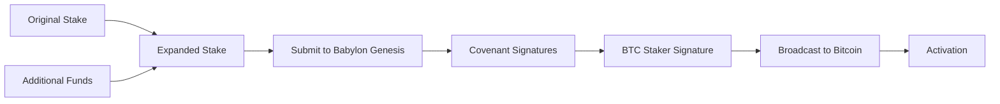
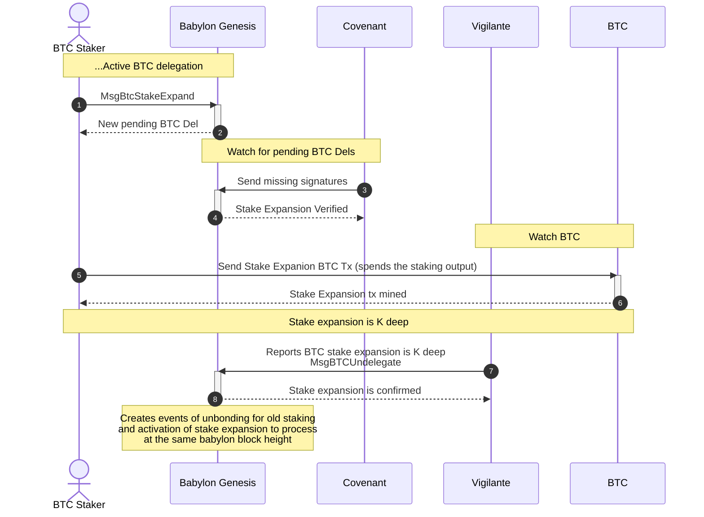

# Bitcoin Stake Expansion

## Table of Contents

1. [Introduction](#1-introduction)
2. [Bitcoin Stake Expansion Methods](#2-bitcoin-stake-expansion-methods)
   1. [Overview of Expansion vs Traditional Unbond-Stake-Again](#21-overview-of-expansion-vs-traditional-unbond-stake-again)
   2. [Stake Expansion Transaction Structure](#22-stake-expansion-transaction-structure)
   3. [Expansion Requirements](#23-stake-expansion-requirements)
3. [Bitcoin Stake Expansion Registration](#3-bitcoin-stake-expansion-registration)
   1. [Overview: What You Need for Expansion](#31-overview-what-you-need-for-expansion)
   2. [BTC Staking Parameters Selection](#32-btc-staking-parameters-selection)
   3. [Detailed Transaction Construction](#33-detailed-transaction-construction)
   4. [The `MsgBtcStakeExpand` Babylon Message](#34-the-msgbtcstakeexpand-babylon-message)
   5. [Constructing the `MsgBtcStakeExpand`](#35-constructing-the-msgbtcstakeexpand)
4. [Managing your Bitcoin Stake Expansion](#4-managing-your-bitcoin-stake-expansion)
   1. [Monitoring Expansion Status](#41-monitoring-expansion-status)
   2. [Activation Process](#42-activation-process)

---

This document walks through the process of expanding existing Bitcoin stakes on
the Babylon Genesis chain. Bitcoin Stake Expansion allows existing active delegations to
add new finality providers to secure new BSNs,
increase staking amounts, or extend timelock
periods without requiring the traditional unbonding process.

**Target Audience**: This document is intended as a reference for technical
readers implementing Bitcoin stake expansion functionality in staking
platforms, wallet integrations, or custom Bitcoin staking solutions.

## 1. Introduction

Bitcoin Stake Expansion enables existing active BTC delegations to be
extended without having to wait for the on-demand unbonding period. This
process maintains continuous reward earning and voting power while allowing
stakers to:

- **Add New Finality Providers**: Extend security to additional BSNs by
  delegating to new finality providers
- **Increase Staking Amount**: Add more BTC to existing stakes using additional
  funding UTXOs
- **Extend Timelock Periods**: Renew or extend the staking duration

**Key Benefits:**
- Zero downtime for voting power and rewards
- No unbonding fees or waiting periods
- Atomic activation process (unbond and activation in same babylon block)
- Maintains security guarantees throughout expansion

**Limitations**: The stake expansion protocol, can't be used for the following:
- Modify the finality provider selection of an already secured BSN
- Remove delegation from a finality provider.

The only way to achieve those is by on-demand unbonding and
staking again.

### 1.1. Terminology

- **Stake Expansion**: The protocol of expanding a stake.
- **Stake Expansion Submission**:
  The submission of the Stake Expansion to Babylon Genesis.
- **Original Staking Transaction**: The original staking transaction
  that is now getting expanded through the Stake Expansion protocol.
- **Expanded Staking Transaction**: The new staking transaction expanding
  the original staking transaction by using its staking output as an input
  and following the rules of the Stake Expansion protocol. 
  > *Note*: An expanded staking transaction can serve as the original
  > staking transaction for a subsequent stake expansion operation.

## 2. Bitcoin Stake Expansion Methods

### 2.1 Overview of Expansion vs Traditional Unbond-Stake Again

**Traditional Multi-Chain Staking Flow:**

1. Wait the on-demand unbonding period
2. Create new staking transaction
3. Wait for activation
4. Activated

**Stake Expansion Flow:**

1. Create a stake expansion transaction
2. Wait for activation
3. Atomic unbonding of prior staking transaction
   and activation of expanded staking transaction.

> **⚡ Note**: Expansion maintains reward earning throughout the entire
> process, only transitioning atomically upon final activation.

### 2.2. Stake Expansion Transaction Structure

## Message Structure

Stake expansion uses the `MsgBtcStakeExpand` message, which extends
`MsgCreateBTCDelegation` with two additional fields:

- `previous_staking_tx_hash`: Hash of the active staking transaction
  being expanded
- `funding_tx`: Bitcoin transaction providing additional funds for the expansion

All other fields (`staker_addr`, `btc_pk`, `fp_btc_pk_list`, `staking_time`,
`staking_value`, etc.) follow the same structure as standard BTC delegation
creation.

## Transaction Data Structure

The stake expansion staking transaction is fundamentally a normal Bitcoin
staking transaction that spends an existing staking output. The key difference
lies in its input structure:

**Standard Staking Transaction:**
```
Inputs:
- Input 0: Funding UTXO (controlled by staker's Bitcoin key)

Outputs:
- Output 0: Staking output (following the staking script format)
```

**Stake Expansion Staking Transaction:**
```
Inputs:
- Input 0: Original staking output (from previous active delegation)
- Input 1: Funding UTXO (from the funding_tx transaction)

Outputs:  
- Output 0: New expanded staking output (following the staking script format)
```

## Funding Transaction

The **funding transaction** (`funding_tx` field) is a separate, confirmed
Bitcoin transaction that:

1. Provides Additional Funds and contains a UTXO controlled by the staker's
  Bitcoin key
2. Ensures the expansion transaction has sufficient fees for Bitcoin network
  inclusion
3. Allows the expanded staking amount to be ≥ the original amount
4. Required to be confirmed on Bitcoin before expansion submission to Babylon

The funding transaction is referenced by the expansion staking transaction's
Input 1, which spends the funding UTXO to provide the additional satoshis
needed for expansion.

### 2.3 Stake Expansion Requirements

To ensure the overall safety of the system,
each stake expansion transaction should follow the following rules:

The Stake Expansion protocol defines certain rules for
the expanded staking transaction in relation to both the original
staking transaction and its state on Babylon Genesis.

- As defined in the prior section, the expanded staking transaction should have
  exactly two outputs:
  (1) the original staking output and
  (2) the funding UTXO
- The funding UTXO should not correspond to any BTC Staking Output known
  to Babylon Genesis.
- The finality providers list in the expanded staking transaction should
  contain *all* finality providers from the original staking transaction
  and optionally new ones corresponding to different BSNs.
- The original staking transaction must have an `ACTIVE` on Babylon Genesis.
- The staking amount in the expanded staking transaction must be ≥ original amount
  > This requirement is the primary reason the stake expansion staking transaction
  > needs an additional funding UTXO input:
  > the original staking output alone wouldn’t suffice,
  > as Bitcoin transaction fees must be deducted,
  > and those fees can't be covered by the staking output itself
  > as the new staking output should at least have the same BTC as it. 
- The staking expansion should use the current Babylon Genesis staking parameters.
  Documentation on how to select the appropriate parameters can be found
  in the [staking registration document](./register-bitcoin-stake.md#32-babylon-genesis-chain-btc-staking-parameters).
  > **Note**: The stake expansion protocol closely follows the
  > [pre-staking registration flow](./register-bitcoin-stake.md#23-pre-staking-registration),
  > where the transaction is first submitted to Babylon Genesis for confirmation
  > before being broadcast to the Bitcoin network.
  > As a result, the stake expansion transaction must use the current Bitcoin
  > staking parameters as defined by Babylon Genesis at the time of submission.
  > It is allowed for the original staking transaction and
  > the stake expansion staking transaction to use different staking parameters.
- The Babylon Genesis address used to submit the stake expansion transaction to Babylon Genesis
  should be the same as the owner of the original staking transaction.

> **⚠️ Critical**: All stake expansion transactions that do not follow
> the aforementioned rules will be rejected.
> Make sure that you first communicate your stake expansion transaction to
> Babylon Genesis for confirmation before submitting to Bitcoin.

## 3. Bitcoin Stake Expansion Registration

### 3.1 Overview: What You Need for Expansion

To expand a Bitcoin stake, you need to submit a `MsgBtcStakeExpand` message
containing:

1. **A reference to your original stake**: Transaction hash of the active
   delegation to expand.
2. **Expansion transaction**: A special 2-input Bitcoin transaction spending
   the original staking output and the funding output.
3. **Updated delegation values**: New finality providers (superset) and/or
  updated amounts and timelock.
  > **Note**: Each stake expansion transaction starts with a new timelock
  > which is the value defined here.
4. **Funding Transaction**: The Bitcoin transaction from which an output will
   be used as the funding output of the expanded staking transaction.
5. **Security signatures**: Proof of possession and pre-signed slashing
   consent.

**High-Level Process:**



Notice that the procedure looks very similar to the pre-staking
registration flow, with the main difference being that
one of the inputs in this case is an already active staking output.

### 3.2. BTC Staking Parameters Selection

The BTC Stake expansion protocol transactions are broadcast
to the Babylon Genesis chain prior to the stake expansion
staking transaction is broadcast to Bitcoin. This makes
the parameters selection akin to the one used for,
the [pre-staking registration flow](./register-bitcoin-stake.md#23-pre-staking-registration).

Specifically, the transactions associated with the
BTC Stake expansion operation (expanded staking transaction
and unbonding/slashing transactions for it) must
adhere to the current BTC staking parameters as reflected on
the Babylon Genesis chain and matching with the
**current Babylon Genesis Bitcoin light client tip height**
at expansion submission time.
This pre-commitment ensures parameter consistency even if the expansion is
later included in a Bitcoin block with different active parameters.

### 3.3 Detailed Transaction Construction

The Bitcoin expansion transaction and related transactions must follow the
specific structures required by the btcstaking module. These transactions
include:
* **Bitcoin Expansion Transaction**: The main transaction that spends the
  original stake and additional funding to create the expanded stake
* **Slashing Transaction**: A pre-signed transaction consenting to slashing
  in case of double-signing for the expanded stake
* **Unbonding Transaction**: The on-demand unbonding transaction used to unlock
  the expanded stake before the originally committed timelock expires
* **Unbonding Slashing Transaction**: A pre-signed transaction consenting to
  slashing during the unbonding process in case of double-signing

#### Creating the Bitcoin Expansion Transaction

The expansion transaction must follow a strict two-input structure validated 
by the btcstaking module:

**Required Transaction Structure:**
- **Input 0**: Previous staking transaction output (the original active
  delegation)
  * Must reference the exact UTXO from the original staking transaction
  * Requires covenant signatures for spending (obtained from Babylon node)
  * Must match the `previous_staking_tx_hash` provided in the expansion message
- **Input 1**: Additional funding UTXO (controlled by staker)
  * Must be controlled by the same Bitcoin key used for staking
  * Provides funds for staking value increase and transaction fees
  * Must be from a confirmed Bitcoin transaction (the `funding_tx`)
- **Output 0**: New expanded staking output
  * Must follow the [staking script format](./staking-script.md) exactly
  * Uses the expanded finality provider list (superset of original)
  * Contains the new total staking value (≥ original amount)
  * Must use current Babylon staking parameters

<!-- TODO: change output? -->

#### Critical: Signing the Expansion Transaction

**The expansion transaction signing process is different from regular Bitcoin
transactions** because Input 0 (the original staking output) requires covenant
signatures to be spent through the unbonding path.



**Step-by-Step Signing Process:**

1. **Retrieve Covenant Signatures from Babylon Node**:
   ```bash
   # Query the original delegation to get covenant signatures
   babylond query btcstaking btc-delegation [previous-staking-tx-hash]
   ```
   The response includes a `StkExp` (StakeExpansionResponse) field containing
  the covenant signatures needed to spend the original staking output.
  These signatures are pre-computed by the covenant committee for expansion
  purposes.

2. **Create the Staker Signature for Input 1**:
  - Sign Input 1 (funding UTXO) using your Bitcoin private key
  - This follows standard Bitcoin signing procedures (legacy or SegWit
  depending on UTXO type)

3. **Compose the Transaction Witness**:
  - **Input 0 Witness**: Combine the covenant signatures (from step 1) with
  your staker signature to create the witness stack for spending the original
  staking output via unbonding path
  - **Input 1 Witness**: Your signature for spending the funding UTXO

4. **Finalize and Broadcast**:
  - The fully signed expansion transaction can now be broadcast to the Bitcoin
  network
  - Submit the transaction hash and inclusion proof to Babylon after confirmation

**Important Signature Details:**

- **Input 0 (Original Staking Output)**:
  - Spends via **unbonding path** of the staking script
  - Requires: Staker signature + Covenant signatures (quorum)
  - Covenant signatures are **provided by Babylon node** in delegation response
  - Staker must sign with the same Bitcoin key used for original stake

- **Input 1 (Funding UTXO)**:
  - Spends via normal Bitcoin script (P2PKH, P2WPKH, etc.)
  - Requires: Only staker signature
  - Must use same Bitcoin key as staking key for consistency

**Common Signing Mistakes:**
- ❌ Trying to create covenant signatures yourself - they must come from
  Babylon node
- ❌ Using wrong signing path for Input 0 - must use unbonding path, not
  timelock path
- ❌ Missing covenant signatures in witness - transaction will be invalid
- ❌ Using different Bitcoin keys for Input 0 and Input 1 - must be the same key

> **⚡ Note**: Once you submit `MsgBtcStakeExpand` to Babylon, it creates a 
> pending delegation. Covenants then read the pending delegation and provide 
> the missing signatures needed to spend the original stake. After receiving 
> covenant signatures, the BTC staker adds their signature and broadcasts 
> the expansion transaction to Bitcoin.

**Input Requirements:**
The expansion transaction inputs must be constructed carefully:

1. **Input 0 (Original Stake)**:
  * `previous_output`: Reference to the original staking transaction output
  * `txid`: Transaction hash of the original staking transaction
  * `vout`: Output index of the staking output (typically 0)
  * `script_sig`: Initially empty (signatures added during covenant
  verification)
  * `sequence`: Set according to Bitcoin transaction requirements

2. **Input 1 (Funding UTXO)**:
   * `previous_output`: Reference to the funding transaction output
     * `txid`: Transaction hash from the `funding_tx`
     * `vout`: Output index containing the funding amount
   * `script_sig`: Signature spending the funding UTXO (if legacy input)
   * `witness`: Witness data for spending the funding UTXO (if SegWit input)
   * `sequence`: Set according to Bitcoin transaction requirements

**Output Construction:**  
The expansion transaction must create exactly one output:

* **Output 0 (Expanded Staking Output)**:
  * `value`: Total expanded staking amount in satoshis
  * `pk_script`: The staking script constructed using:
    * Staker's Bitcoin public key (same as original)
    * Expanded finality provider list (superset of original)
    * Current covenant committee public keys and quorum
    * New staking timelock period
    * Current unbonding timelock from parameters

#### Creating Slashing Transactions

Both staking and unbonding slashing transactions must be created for the
expansion:

**Staking Slashing Transaction:**
* **Input 0**: Spends the expansion staking output via slashing path
  * `previous_output`: References the expansion transaction output
  * `script_sig`: Initially empty (signatures added during verification)
  * Contains placeholder for staker, covenant, and finality provider signatures
* **Output 0**: Slashing output using current `slashing_pk_script`
  * `value`: Calculated based on `slashing_rate` and staking amount
  * `pk_script`: Must match the current `slashing_pk_script` parameter
* **Output 1** (if applicable): Change output
  * `value`: Remaining funds after slashing and fees
  * `pk_script`: Change script following the staking script format

**Unbonding Slashing Transaction:**
* **Input 0**: Spends the unbonding output via slashing path
  * `previous_output`: References the unbonding transaction output
  * Similar signature structure to staking slashing transaction
* **Outputs**: Same structure as staking slashing transaction

#### Creating the Unbonding Transaction

The unbonding transaction allows on-demand unlock of the expanded stake:

**Transaction Structure:**
* **Input 0**: Spends the expansion staking output via unbonding path
  * `previous_output`: References the expansion transaction output
  * `script_sig`: Initially empty (staker signature added for unbonding)
* **Output 0**: Unbonding output
  * `value`: Expanded staking amount minus unbonding fees
  * `pk_script`: Unbonding script with current `unbonding_time_blocks`

**Transaction Construction:**
You can create these transactions using:
- [The Golang BTC staking library](../btcstaking) with expansion utilities
- [The TypeScript BTC staking library](https://github.com/babylonlabs-io/btc-staking-ts) 
- Your own implementation following the [Bitcoin staking script specification](./staking-script.md)

> **⚡ Note**: All transactions must use the current Babylon staking parameters 
> retrieved from the Bitcoin light client tip height at expansion submission time.

> **⚠️ Critical Warning**: The expansion transaction must spend exactly 2 inputs 
> in the specified order. The btcstaking module's validation will reject 
> non-conforming transactions. Additionally, all transaction fee calculations 
> must account for the minimum fees specified in the staking parameters.

### 3.4. The `MsgBtcStakeExpand` Babylon Message

The `MsgBtcStakeExpand` message in the btcstaking module handles stake
expansion registration:

#### Key Fields in `MsgBtcStakeExpand`

```protobuf
// MsgBtcStakeExpand is the message for expanding existing BTC stakes
message MsgBtcStakeExpand {
  option (cosmos.msg.v1.signer) = "staker_addr";
  
  // Standard delegation fields (same as MsgCreateBTCDelegation)
  string staker_addr = 1;
  ProofOfPossessionBTC pop = 2;
  bytes btc_pk = 3;
  repeated bytes fp_btc_pk_list = 4;  // Must be superset of previous FPs
  uint32 staking_time = 5;            // New/extended timelock period  
  int64 staking_value = 6;            // Total new amount (≥ previous)
  bytes staking_tx = 7;               // Expansion transaction
  
  // Slashing transactions for expanded stake
  bytes slashing_tx = 8;
  bytes delegator_slashing_sig = 9;
  uint32 unbonding_time = 10;
  bytes unbonding_tx = 11;
  int64 unbonding_value = 12;
  bytes unbonding_slashing_tx = 13;
  bytes delegator_unbonding_slashing_sig = 14;
  
  // Expansion-specific fields
  string previous_staking_tx_hash = 15;  // Hash of original delegation
  bytes funding_tx = 16;                 // Transaction with funding UTXO
  
  // Note: staking_tx_inclusion_proof omitted (pre-staking flow)
}
```

#### Explanation of Fields

* `staker_addr`:
  A Bech32-encoded Babylon address (`bbn...`) representing the
  staker's Babylon account where staking rewards will be accumulated.
  *This must be the same address that signed the original delegation and 
  must also sign the expansion registration transaction*. The babylon signer
  address must be the same from the old stake (staker_addr).
  
  Example: `"bbn1abc123def456ghi789jkl012mno345pqr678stu901vwx234yz"`

* `pop` (Proof of Possession):
  A cryptographic signature proving that the submitter of the expansion
  registration transaction is the owner of the Bitcoin private key used for staking.
  This must be the same Bitcoin key used in the original delegation being expanded.
  * `btc_sig_type`: Specifies the signature algorithm used.
    The options are:
    * `0` for [BIP-340 (Schnorr Signatures)](https://github.com/bitcoin/bips/blob/master/bip-0340.mediawiki)
    * `1` for [BIP-322 (Generic Signing format)](https://github.com/bitcoin/bips/blob/master/bip-0322.mediawiki)
      * Note that the [simple](https://github.com/bitcoin/bips/blob/master/bip-0322.mediawiki#simple) signature format is used.
    * `2` for [ECDSA (Elliptic Curve Digital Signature Algorithm)](https://github.com/bitcoin/bips/blob/master/bip-0137.mediawiki)
  * `btc_sig`: The signature generated by signing the staker address using the
    chosen algorithm. The verification process differs by algorithm:
  * **BIP-340**: The hash of the staker address bytes should be signed.
  * **BIP-322**: Bytes of the bech32 encoded address should be signed.
  * **ECDSA**: Bytes of the bech32 encoded address should be signed.
  
  Example (BIP-340):
  ```json
  {
    "btc_sig_type": 0,
    "btc_sig": "f1e2d3c4b5a69788c9d0e1f2a3b4c5d6e7f8a9b0c1d2e3f4a5b6c7d8e9f0a1b2c3d4e5f6a7b8c9d0e1f2a3b4c5d6e7f8a9b0c1d2e3f4a5b6c7d8e9f0a1b2"
  }
  ```

* `btc_pk`:
  This Bitcoin `secp256k1` public key of the BTC staker,
  in BIP-340 format (Schnorr signatures). It is a compact, 32-byte
  value derived from the staker's private key. This public key must be
  exactly the same as the one used in the original delegation being expanded,
  as it corresponds to the staker public key used to construct the 
  [staking script](./staking-script.md) used in both the original and expansion
  BTC Staking transactions.
  
  Example: `"7b3a9c8e5f1d2a4c6b8d9e0f1a2c3e4f5b6c7d8e9f0a1b2c3d4e5f6a7b8c9d0e"`

* `fp_btc_pk_list`:
  A list of the `secp256k1` public keys of the finality providers
  (FPs) to which the expanded stake is delegated in BIP-340 format (Schnorr
  signatures)
  and compact 32-byte representation. **This list must be a superset of the
  finality
  providers from the original delegation** - you cannot remove existing finality
  providers, only add new ones.
  
  Example: 
  ```json
  [
    "7b3a9c8e5f1d2a4c6b8d9e0f1a2c3e4f5b6c7d8e9f0a1b2c3d4e5f6a7b8c9d0e",
    "e2f3a4b5c6d7e8f9a0b1c2d3e4f5a6b7c8d9e0f1a2b3c4d5e6f7a8b9c0d1e2f3",
    "a9b8c7d6e5f4a3b2c1d0e9f8a7b6c5d4e3f2a1b0c9d8e7f6a5b4c3d2e1f0a9b8"
  ]
  ```
  
  > **⚠️ Critical Requirement**: The expansion finality provider list must
  > include
  > all finality providers from the original delegation plus any additional ones.
  > The btcstaking module will reject expansions that attempt to remove existing
  > finality providers. Query the original delegation to retrieve the current
  > finality provider list before constructing the expansion.

* `staking_time`:
  The duration of staking in Bitcoin blocks for the expanded delegation. 
  This can be the same as or longer than the original delegation's staking time.
  This is the same as the timelock used when constructing the 
  [staking script](./staking-script.md) and must comply with the current
  Babylon staking parameters.

* `staking_value`:
  The total amount of satoshis locked in the staking output of the expansion
  BTC staking transaction (`staking_tx`). This value must be greater than or
  equal to the original delegation's staking value. The increase comes from
  the additional funding UTXO provided in the expansion transaction.

* `staking_tx`:
  The Bitcoin expansion transaction in hex format. This transaction must have
  exactly 2 inputs: the original staking output (Input 0) and an additional
  funding UTXO (Input 1). The transaction creates a new staking output that
  follows precisely the [staking script](./staking-script.md) format using the
  correct Bitcoin staking parameters and expanded finality provider list.
  > **⚠️ Critical Structure**: The expansion transaction must follow the exact
  > two-input structure validated by the btcstaking module. Input 0 must spend
  > the original staking transaction output, and Input 1 must be the additional
  > funding UTXO controlled by the staker's key.

* `slashing_tx` / `delegator_slashing_sig`:
  The slashing transaction that spends the expansion BTC staking transaction
  through the slashing path and the staker's BIP-340 (Schnorr) signature for it.
  Both are in hex format. This transaction must be constructed specifically
  for the expanded stake parameters and finality provider list.
  This transaction is considered fully signed once it has signatures
  from the staker, a quorum of the covenants, and all finality providers.
  Upon expansion verification, the covenant signatures are added,
  meaning that only the finality providers' signatures are missing.

* `unbonding_time`:
  The on-demand unbonding period measured in Bitcoin blocks for the expanded
  delegation. This is the same as the timelock used when constructing
  the [unbonding script](./staking-script.md) and must comply with the current
  Babylon staking parameters.

* `unbonding_tx`:
  The unsigned unbonding transaction in hex format for the expanded stake.
  This transaction spends the expansion staking output and creates an unbonding
  output with the expanded parameters. The submission of this unbonding
  transaction is required for covenant verification and slashing transaction
  validation.

* `unbonding_value`:
  The amount of satoshis committed to the unbonding output of the expansion
  unbonding transaction. This should account for the expanded staking value
  minus appropriate transaction fees.

* `unbonding_slashing_tx` / `delegator_unbonding_slashing_sig`:
  The slashing transaction that spends the expansion on-demand unbonding
  transaction through the slashing path and the staker's BIP-340 (Schnorr)
  signature for it. Both are in hex format. This transaction must be
  constructed for the expanded unbonding parameters and finality provider list.

#### Expansion-Specific Field Details

* `previous_staking_tx_hash`:
  The transaction hash (in hex format) of the original active staking
  transaction being expanded. This can be obtained by:
  * Querying your wallet or staking interface for your active delegations
  * Using the Babylon CLI: `babylond query btcstaking delegations-by-staker [staker-address]`
  * Checking the original delegation registration transaction on a Babylon block
  explorer The btcstaking module uses this hash to locate and validate the
  previous delegation before processing the expansion.
  
  Example: `"d4c2b8f9a1e5c3d7e9f1a2b3c4d5e6f7a8b9c0d1e2f3a4b5c6d7e8f9a0b1c2d3"`

* `funding_tx`:
  The Bitcoin transaction (in hex format) containing the additional UTXO used as
  the second input in the expansion transaction. This transaction must:
  * Have been confirmed on the Bitcoin network before expansion submission
  * Contain a UTXO that is controlled by the same Bitcoin key used for staking
  * Provide sufficient funds to cover the staking value increase and transaction
  fees. You can obtain this by creating a standard Bitcoin transaction that
  sends funds to an address controlled by your staking Bitcoin key, then
  using that transaction as the funding source.

> **⚠️ Critical Validation**: The btcstaking module performs strict validation
> on the relationship between the original delegation, expansion parameters, and
> funding transaction. Ensure all expansion fields are consistent with the
> original delegation and current staking parameters.

> **⚡ Note**: The expansion message follows the pre-staking registration pattern. 
> The inclusion proof is submitted later after Bitcoin confirmation via 
> `MsgAddBTCDelegationInclusionProof`.

### 3.5. Constructing the `MsgBtcStakeExpand`

There are multiple ways to construct and broadcast the `MsgBtcStakeExpand`
  message to the Babylon network:
* **Command Line Interface (CLI)**: 
  Use the `babylond tx btcstaking btc-stake-expand` command.
* **TypeScript Implementation**: 
  Generate the message using TypeScript following this
  [reference implementation](https://github.com/babylonlabs-io/simple-staking/blob/2b9682c4f779ab39562951930bc3d023e5467461/src/app/hooks/services/useTransactionService.ts#L672-L679) and broadcast to the Babylon network.
* **Golang Implementation**: 
  Construct the message using Golang based on this
  [type reference](../x/btcstaking/types/tx.pb.go) and broadcast to the Babylon
  network.
* **External References**: 
  For detailed instructions on broadcasting transactions, refer to the external
  [Cosmos SDK documentation](https://docs.cosmos.network/main/learn/advanced/transactions#broadcasting-the-transaction).

> **⚠️ Important**: The expansion message undergoes the same covenant
> verification process as new delegations. Ensure all slashing transactions
> and signatures are properly constructed according to the
> [staking script specification](./staking-script.md).

## 4. Managing your Bitcoin Stake Expansion

### 4.1 Monitoring Expansion Status

After submitting a `MsgBtcStakeExpand`, the btcstaking module creates a new
delegation in `PENDING` status while the original staking transaction
remains `ACTIVE`.

**Querying Delegation Status:**
```bash
# Query the new expanded delegation
babylond query btcstaking btc-delegation [expansion-delegation-hash]

# Query the original delegation  
babylond query btcstaking btc-delegation [previous-staking-tx-hash]
```

**Status Progression:**
1. **PENDING**: Stake Expansion submitted, awaiting covenant verification
2. **VERIFIED**: Covenant signatures for stake expansion unbonding and
   slashing transactions collected
3. **ACTIVE**: Stake expansion activated, original delegation switched to `UNBONDED`.

### 4.2 Activation Process

Expansion activation follows the atomic state transition model used by the
btcstaking module:

**Activation Process:**
1. **Bitcoin Confirmation**: Expansion transaction reaches k-depth on Bitcoin
2. **Inclusion Proof**: Submitted via existing `MsgBTCUndelegate`
  (not `MsgAddBTCDelegationInclusionProof`)
3. **Atomic Transition**: btcstaking module updates both delegations
  simultaneously
4. **Final State**: Original delegation becomes `UNBONDED`, expansion becomes
  `ACTIVE`

**Monitoring Activation:**
```bash
# Monitor for activation events
babylond query btcstaking delegations-by-staker [staker-address]

# Check for unbonding of original delegation
babylond query btcstaking btc-delegation [previous-staking-tx-hash]
```

> **⚡ Note**: The atomic activation ensures no gap in voting power or reward
> earning during the transition from original to expanded delegation.

> **⚠️ Critical Warning**: For stake expansions, the inclusion proof must be
> submitted via `MsgBTCUndelegate`, not `MsgAddBTCDelegationInclusionProof`.
> The btcstaking module will reject expansion inclusion proofs submitted through
> the standard inclusion proof message.

---

**Additional Resources:**
- [Bitcoin Stake Registration Guide](./register-bitcoin-stake.md)
- [Bitcoin Staking Script Specification](./staking-script.md)
- [BTC Staking Module Documentation](../x/btcstaking/)