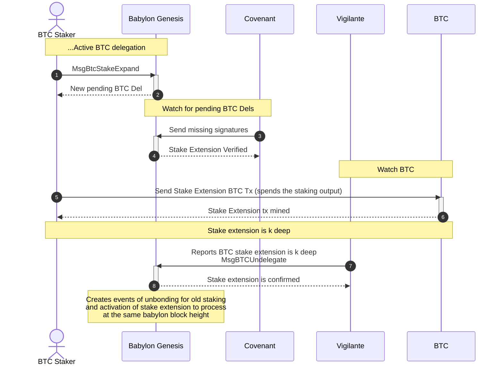
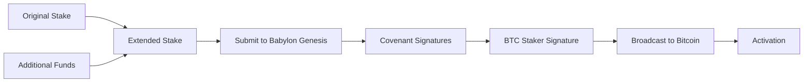

# Bitcoin Stake Extension

## Table of Contents

1. [Introduction](#1-introduction)
2. [Stake Extension Protocol](#2-stake-extension-protocol)
   1. [Stake Extension Procedure](#21-stake-extension-procedure)
   2. [Stake Extension Transaction Structure](#22-stake-extension-transaction-structure)
   3. [Stake Extension Requirements](#23-stake-extension-requirements)
3. [Bitcoin Stake Extension Registration](#3-bitcoin-stake-extension-registration)
   1. [Overview: Required Transactions](#31-overview-required-transactions)
   2. [BTC Staking Parameters Selection](#32-btc-staking-parameters-selection)
   3. [Detailed Transaction Construction](#33-detailed-transaction-construction)
   4. [The `MsgBtcStakeExpand` Babylon Message](#34-the-msgbtcstakeextend-babylon-message)
   5. [Constructing the `MsgBtcStakeExpand`](#35-constructing-the-msgbtcstakeextend)
   6. [Broadcasting the Fully Signed Stake Extension Transaction](#36-broadcasting-the-fully-signed-stake-extension-transaction)
4. [Managing your Bitcoin Stake Extension](#4-managing-your-bitcoin-stake-extension)
   1. [Monitoring Extension Status](#41-monitoring-extension-status)
   2. [Activation Process](#42-activation-process)

---

This document walks through the process of extending existing Bitcoin stakes on
the Babylon Genesis chain. Bitcoin Stake Extension allows existing active delegations to
increase staking amounts or extend timelock
periods without requiring the traditional unbonding process.

**Target Audience**: This document is intended as a reference for technical
readers implementing Bitcoin stake extension functionality in staking
platforms, wallet integrations, or custom Bitcoin staking solutions.

## 1. Introduction

Bitcoin Stake Extension enables existing active BTC delegations to be
extended without having to wait for the on-demand unbonding period. This
process maintains continuous reward earning and voting power while allowing
stakers to:

- **Increase Staking Amount**: Add more BTC to existing stakes using additional
  funding UTXOs
- **Extend Timelock Periods**: Renew or extend the staking duration

**Key Benefits:**
- Zero downtime for voting power and rewards
- No unbonding fees or waiting periods
- Atomic activation process (unbond and activation in the same Babylon Genesis block)
- Maintains security guarantees throughout extension

**Limitations**: The stake extension protocol can't be used for the following:
- Add new finality providers
- Remove existing finality providers
- Modify finality provider selections

The only way to achieve those is by on-demand unbonding and
staking again.

### 1.1. Terminology

- **Stake Extension**: The protocol of extending a stake.
- **Stake Extension Submission**:
  The submission of the Stake Extension to Babylon Genesis.
- **Original Staking Transaction**: The original staking transaction
  that is now getting extended through the Stake Extension protocol.
- **Extended Staking Transaction**: The new staking transaction extending
  the original staking transaction by using its staking output as an input
  and following the rules of the Stake Extension protocol.
  > **Note**: An extended staking transaction can serve as the original
  > staking transaction for a subsequent stake extension operation.

## 2. Stake Extension Protocol

### 2.1. Stake Extension Procedure

The stake extension procedure operates as follows:
1. **Stake Extension Request**: The staker submits
   a stake extension request on Babylon Genesis. The request
   includes the extended staking transaction that spends over
   the original staking transaction through the on-demand unbonding
   script path. The Babylon Genesis chain records the request.
2. **Covenants Verify the Request**: The Covenants identify
   the stake extension request and verify it by submitting
   their signatures for both the spending of the original
   staking transaction and the on-demand unbonding and slashing
   transactions of the extended staking transaction.
3. **Submission to Bitcoin**: The staker, having received all
   necessary signatures submits the fully signed extended staking
   transaction to Bitcoin.
4. **Monitoring for Confirmation**: A vigilante tracker (or the staker themself)
   monitors Bitcoin for the confirmation status of the stake extension transaction.
   Once this happens, the inclusion proof is submitted to Babylon Genesis.
5. **Stake Extension Activation**: Once a valid proof of inclusion in a sufficiently confirmed block
   is submitted for a stake extension, the extended staking transaction becomes active
   and the original staking transaction becomes unbonded.
   *The switch is an atomic operation*.

> **Note**: The stake extension procedure is similar to the
> pre-staking registration procedure in the sense that the
> staker first submits to Babylon Genesis before broadcasting to
> Bitcoin.



### 2.2. Stake Extension Transaction Structure

All extended staking transactions are normal
Bitcoin staking transaction as per the
[specification](./staking-script.md#bitcoin-staking-transactions-specification).
What makes them unique is the requirement that they follow the following structure:
* **Two Inputs** in the following precise order:
  * **First Input**: The original staking output that is being extended.
  * **Second Input**: Funding output used to pay for fees and/or increase the
    stake amount. It can come from any transaction as long as it was never
    a staking output.
* **Any number of outputs** with at least *one* corresponding to the
  extended staking transaction staking output. The Babylon chain requires that the new staking output value must be at least the same as the old staking value.

### 2.3 Stake Extension Requirements

The Stake Extension protocol defines certain rules for
the extended staking transaction in relation to both the original
staking transaction and its state on Babylon Genesis.

- **Exactly Two Inputs** The extended staking transaction should have
  exactly two inputs:
  (1) the original staking output and
  (2) the funding UTXO
- **Funding UTXO**: The funding UTXO should not correspond
  to any BTC staking output known to Babylon Genesis.
- **Finality Providers**: The finality providers list in the extended staking transaction must
  contain exactly the same finality providers as the original staking transaction.
- **Original Staking Status**: The original staking transaction must have an `ACTIVE` status on Babylon Genesis.
- **Extended Stake Staking Amount**: The staking amount in the extended staking transaction must be ≥ original amount
  > This requirement is the primary reason the stake extension staking transaction
  > needs an additional funding UTXO input:
  > the original staking output alone wouldn’t suffice,
  > as Bitcoin transaction fees must be deducted,
  > and those fees can't be covered by the staking output itself
  > as the new staking output should at least have the same BTC as it.
- **BTC Staking Params**: The staking extension should use the current Babylon Genesis staking parameters.
  Documentation on how to select the appropriate parameters can be found
  in the [staking registration document](./register-bitcoin-stake.md#32-babylon-genesis-chain-btc-staking-parameters).
  > **Note**: The stake extension protocol closely follows the
  > [pre-staking registration flow](./register-bitcoin-stake.md#23-pre-staking-registration),
  > where the transaction is first submitted to Babylon Genesis for confirmation
  > before being broadcast to the Bitcoin network.
  > As a result, the stake extension transaction must use the current Bitcoin
  > staking parameters as defined by Babylon Genesis at the time of submission.
  > It is allowed for the original staking transaction and
  > the stake extension staking transaction to use different staking parameters.
- **Submitter Address**: The Babylon Genesis address used to submit the stake extension transaction to Babylon Genesis
  should be the same as the owner of the original staking transaction.
- **Staker Bitcoin Public key**: The Bitcoin public key used in the extended staking transaction staking output should
  be the same as the original staking output.

> **⚠️ Critical**: All stake extension transactions that do not follow
> the aforementioned rules will be rejected.
> Make sure that you first communicate your stake extension transaction to
> Babylon Genesis for confirmation before submitting to Bitcoin.

## 3. Bitcoin Stake Extension Registration

### 3.1 Overview: Required Transactions

To extend a Bitcoin stake, you need to submit a `MsgBtcStakeExpand` message
containing:

1. **A reference to your original stake**: Transaction hash of the active
   delegation to extend.
2. **Extension transaction**: A special 2-input Bitcoin transaction spending
   the original staking output and the funding output.
3. **Updated delegation values**: Updated amounts and/or timelock.
  > **Note**: Each stake extension transaction starts with a new timelock
  > which is the value defined here.
4. **Funding Transaction**: The Bitcoin transaction from which an output will
   be used as the funding output of the extended staking transaction.
5. **Security signatures**: Proof of possession and pre-signed slashing
   consent.

**High-Level Process:**



### 3.2. BTC Staking Parameters Selection

The BTC Stake extension protocol transactions are broadcast
to the Babylon Genesis chain before the corresponding stake
extension transaction is broadcast to Bitcoin. This makes
the parameters selection akin to the one used for,
the [pre-staking registration flow](./register-bitcoin-stake.md#23-pre-staking-registration).

Specifically, the transactions associated with the
BTC Stake extension operation (extended staking transaction
and unbonding/slashing transactions for it) must
adhere to the current BTC staking parameters as reflected on
the Babylon Genesis chain and matching with the
**current Babylon Genesis Bitcoin light client tip height**
at extension submission time.
This pre-commitment ensures parameter consistency even if the extension is
later included in a Bitcoin block with different active parameters.

### 3.3 Detailed Transaction Construction

The Bitcoin stake extension protocols requires a set of transactions
which must follow the specific structures required by the Babylon Genesis chain.
These transactions include:
* **Extension Staking Transaction**: The main transaction that spends the
  original staking output and the additional funding output
  to create the extended stake
* **Slashing Transaction**: A pre-signed transaction spending the extension staking transaction
  through the slashing path and consenting to slashing
  in case of double-signing for the extended stake
* **Unbonding Transaction**: The on-demand unbonding transaction used to unlock
  the extended stake before the originally committed timelock expires
* **Unbonding Slashing Transaction**: A pre-signed transaction consenting to
  slashing during the unbonding process in case of double-signing

> **Important**:
> The extension transaction must follow a strict two-input structure validated
> by the Babylon Genesis chain:
> - **Input 0**: Original staking transaction output
>   * Must reference the exact UTXO from the original staking transaction
>   * Spent via the unbonding path of the staking script (requires staker + covenant signatures).
> - **Input 1**: Additional funding UTXO utilized to ensure that
>   the extended stake staking amount is >= the original stake staking amount.
> - **Outputs**: The stake extension transaction can have an arbitrary
>   number of outputs, with one of those serving as the extended stake
>   staking output. This output:
>   * Must follow the [staking output format](./staking-script.md)
>   * Uses the same finality provider list as the original
>   * Contains the new total staking value (≥ of the original amount)
>   * Must use current Babylon staking parameters
>
> The rest of the transactions are the same as with the typical
> [BTC Stake Registration Protocol](./register-bitcoin-stake.md)

**Transaction Construction:**
You can create these transactions using:
- [The Golang BTC staking library](../btcstaking) with extension utilities
- [The TypeScript BTC staking library](https://github.com/babylonlabs-io/btc-staking-ts)
- Your own implementation following the [Bitcoin staking script specification](./staking-script.md)

> **⚡ Note**: All transactions must use the current Babylon staking parameters
> retrieved from the Bitcoin light client tip height at extension submission time.

> **⚠️ Critical Warning**: The extension transaction must spend exactly 2 inputs
> in the specified order. The btcstaking module's validation will reject
> non-conforming transactions. Additionally, all transaction fee calculations
> must account for the minimum fees specified in the staking parameters.

### 3.4. The `MsgBtcStakeExpand` Babylon Message

The `MsgBtcStakeExpand` message of the `x/btcstaking` module
is used to submit the Stake Extension request.

```protobuf
// MsgBtcStakeExpand is the message for extending existing BTC stakes
message MsgBtcStakeExpand {
  option (cosmos.msg.v1.signer) = "staker_addr";

  // Standard delegation fields (same as MsgCreateBTCDelegation)
  string staker_addr = 1;
  ProofOfPossessionBTC pop = 2;
  bytes btc_pk = 3;
  repeated bytes fp_btc_pk_list = 4;  // Must be identical to previous FPs
  uint32 staking_time = 5;            // New/extended timelock period
  int64 staking_value = 6;            // Total new amount (≥ previous)
  bytes staking_tx = 7;               // Extension transaction

  // Slashing transactions for extended stake
  bytes slashing_tx = 8;
  bytes delegator_slashing_sig = 9;
  uint32 unbonding_time = 10;
  bytes unbonding_tx = 11;
  int64 unbonding_value = 12;
  bytes unbonding_slashing_tx = 13;
  bytes delegator_unbonding_slashing_sig = 14;

  // Extension-specific fields
  string previous_staking_tx_hash = 15;  // Hash of original delegation
  bytes funding_tx = 16;                 // Transaction with funding UTXO

  // Note: staking_tx_inclusion_proof omitted (pre-staking flow)
}
```

#### Explanation of Fields

* `staker_addr`:
  A Bech32-encoded Babylon address (`bbn...`) representing the
  staker's Babylon account where staking rewards will be accumulated.
  *This must be the same address that signed the original delegation and
  must also sign the extension registration transaction*. The Babylon signer
  address must be the same from the old stake (staker_addr).

  Example: `"bbn1abc123def456ghi789jkl012mno345pqr678stu901vwx234yz"`

* `pop` (Proof of Possession):
  A cryptographic signature proving that the submitter of the extension
  registration transaction is the owner of the Bitcoin private key used for staking.
  This must be the same Bitcoin key used in the original delegation being extended.
  * `btc_sig_type`: Specifies the signature algorithm used.
    The options are:
    * `0` for [BIP-340 (Schnorr Signatures)](https://github.com/bitcoin/bips/blob/master/bip-0340.mediawiki)
    * `1` for [BIP-322 (Generic Signing format)](https://github.com/bitcoin/bips/blob/master/bip-0322.mediawiki)
      * Note that the [simple](https://github.com/bitcoin/bips/blob/master/bip-0322.mediawiki#simple) signature format is used.
    * `2` for [ECDSA (Elliptic Curve Digital Signature Algorithm)](https://github.com/bitcoin/bips/blob/master/bip-0137.mediawiki)
  * `btc_sig`: The signature generated by signing the staker address using the
    chosen algorithm. The verification process differs by algorithm:
  * **BIP-340**: The hash of the staker address bytes should be signed.
  * **BIP-322**: Bytes of the bech32 encoded address should be signed.
  * **ECDSA**: Bytes of the bech32 encoded address should be signed.

  Example (BIP-340):
  ```json
  {
    "btc_sig_type": 0,
    "btc_sig": "f1e2d3c4b5a69788c9d0e1f2a3b4c5d6e7f8a9b0c1d2e3f4a5b6c7d8e9f0a1b2c3d4e5f6a7b8c9d0e1f2a3b4c5d6e7f8a9b0c1d2e3f4a5b6c7d8e9f0a1b2"
  }
  ```

* `btc_pk`:
  This Bitcoin `secp256k1` public key of the BTC staker,
  in BIP-340 format (Schnorr signatures). It is a compact, 32-byte
  value derived from the staker's private key. This public key must be
  exactly the same as the one used in the original delegation being extended,
  as it corresponds to the staker public key used to construct the
  [staking script](./staking-script.md) used in both the original and extension
  BTC Staking transactions.

  Example: `"7b3a9c8e5f1d2a4c6b8d9e0f1a2c3e4f5b6c7d8e9f0a1b2c3d4e5f6a7b8c9d0e"`

* `fp_btc_pk_list`:
  A list of the `secp256k1` public keys of the finality providers
  (FPs) to which the extended stake is delegated in BIP-340 format (Schnorr
  signatures)
  and compact 32-byte representation. **This list must be identical to the
  finality
  providers from the original delegation** - you cannot add or remove finality
  providers.

  Example:
  ```json
  [
    "7b3a9c8e5f1d2a4c6b8d9e0f1a2c3e4f5b6c7d8e9f0a1b2c3d4e5f6a7b8c9d0e",
    "e2f3a4b5c6d7e8f9a0b1c2d3e4f5a6b7c8d9e0f1a2b3c4d5e6f7a8b9c0d1e2f3",
    "a9b8c7d6e5f4a3b2c1d0e9f8a7b6c5d4e3f2a1b0c9d8e7f6a5b4c3d2e1f0a9b8"
  ]
  ```

  > **⚠️ Critical Requirement**: The extension finality provider list must
  > be identical to the finality providers from the original delegation.
  > The Babylon Genesis chain will reject extensions that attempt to add or remove
  > finality providers. Query the original delegation to retrieve the current
  > finality provider list before constructing the extension.

* `staking_time`:
  The duration of staking in Bitcoin blocks for the extended delegation.
  This is the same as the timelock used when constructing the
  [staking script](./staking-script.md) and must comply with the current
  Babylon staking parameters by being higher than or equal to
  `min_staking_time_blocks` and lower than or equal to `max_staking_time_blocks`
  > **Important Note**: Every stake extension transaction starts
  > with a fresh timelock, meaning that the time the original
  > staking transaction spent being active will not be deducted from
  > the staking time defined here.

* `staking_value`:
  The total amount of satoshis locked in the staking output of the extension
  BTC staking transaction (`staking_tx`). This value must be greater than or
  equal to the original delegation's staking value. The increase comes from
  the additional funding UTXO provided in the extension transaction.
  > **Critical Requirement**: This value should be >= the original
  > stake's staking amount.

* `staking_tx`:
  The Bitcoin extension transaction in hex format. This transaction must have
  exactly 2 inputs: the original staking output (Input 0) and an additional
  funding UTXO (Input 1). The transaction creates a new staking output that
  follows precisely the [staking script](./staking-script.md) format using the
  correct Bitcoin staking parameters and extended finality provider list.
  > **⚠️ Critical Structure**: The extension transaction must follow the exact
  > two-input structure validated by the btcstaking module. Input 0 must spend
  > the original staking transaction output, and Input 1 must be the additional
  > funding UTXO.

* `slashing_tx` / `delegator_slashing_sig`:
  The slashing transaction that spends the extension BTC staking transaction
  through the slashing path and the staker's BIP-340 (Schnorr) signature for it.
  Both are in hex format. This transaction must be constructed specifically
  for the extended stake parameters and finality provider list.
  This transaction is considered fully signed once it has signatures
  from the staker, a quorum of the covenants, and all finality providers.
  Upon extension verification, the covenant signatures are added,
  meaning that only the finality providers' signatures are missing.

* `unbonding_time`:
  The on-demand unbonding period measured in Bitcoin blocks for the extended
  delegation. This is the same as the timelock used when constructing
  the [unbonding script](./staking-script.md) and must comply with the current
  Babylon Genesis BTC staking parameters.

* `unbonding_tx`:
  The unsigned unbonding transaction in hex format for the extended stake.
  This transaction spends the extension staking output and creates an unbonding
  output with the extended parameters. The submission of this unbonding
  transaction is required for covenant verification and slashing transaction
  validation.

* `unbonding_value`:
  The amount of satoshis committed to the unbonding output of the extension
  unbonding transaction. This should account for the extended staking value
  minus appropriate transaction fees.

* `unbonding_slashing_tx` / `delegator_unbonding_slashing_sig`:
  The slashing transaction that spends the extension on-demand unbonding
  transaction through the slashing path and the staker's BIP-340 (Schnorr)
  signature for it. Both are in hex format. This transaction must be
  constructed for the extended unbonding parameters and finality provider list.

* `previous_staking_tx_hash`:
  The transaction hash (in hex format) of the original active staking
  transaction being extended.

* `funding_tx`:
  The Bitcoin transaction (in hex format) containing the additional UTXO used as
  the second input in the extension transaction. This transaction must
  provide sufficient funds to cover the staking value increase and transaction
  fees.

> **⚠️ Critical Validation**: The btcstaking module performs strict validation
> on the relationship between the original delegation, extension parameters, and
> funding transaction. Ensure all extension fields are consistent with the
> original delegation and current staking parameters.

> **⚡ Note**: The extension message follows the pre-staking registration pattern.
> The inclusion proof is submitted later after Bitcoin confirmation via
> `MsgBTCUndelegate`.

### 3.5. Constructing the `MsgBtcStakeExpand`

There are multiple ways to construct and broadcast the `MsgBtcStakeExpand`
  message to the Babylon network:
* **Command Line Interface (CLI)**:
  Use the `babylond tx btcstaking btc-stake-extend` command.
* **TypeScript Implementation**:
  Generate the message using TypeScript following the
  [TypeScript staking library](https://github.com/babylonlabs-io/btc-staking-ts).
* **Golang Implementation**:
  Construct the message using Golang based on this
  [type reference](../x/btcstaking/types/tx.pb.go) and broadcast to the Babylon
  network.
* **External References**:
  For detailed instructions on broadcasting transactions, refer to the external
  [Cosmos SDK documentation](https://docs.cosmos.network/main/learn/advanced/transactions#broadcasting-the-transaction).

> **⚠️ Important**: The extension message undergoes the same covenant
> verification process as new delegations. Ensure all slashing transactions
> and signatures are properly constructed according to the
> [staking script specification](./staking-script.md).

### 3.6. Broadcasting the Fully Signed Stake Extension Transaction

After the submission of the `MsgBtcStakeExpand` to Babylon Genesis,
the covenants' will verify it and submit their signatures for the
spending of the original staking output and
the unbonding and slashing transactions of the stake extension transaction.

Following is the procedure for utilizing the covenant signatures
for spending the original staking output through the on-demand unbonding
path to create the fully signed stake extension transaction:
1. **Retrieve covenant signatures from the Babylon Genesis chain**
   by querying the original staking transaction hash. The
   response includes a `StkExp` (StakeExtensionResponse) field
   containing the covenant signatures needed to spend the original
   staking output.

   ```bash
   # Query the original delegation to get covenant signatures
   babylond query btcstaking btc-delegation [previous-staking-tx-hash]
   ```
2. **Compose the Witness for Spending the Original Staking Output**
   using the staker's and covenants' signatures.
   > **Note**: This is accomplished the same way the transaction
   > witness is constructed for the on-demand unbonding transaction.

3. **Sign the funding transaction input**

4. **Finalize and Broadcast**:
  - The fully signed extension transaction can now be broadcast to the Bitcoin
  network
  - Submit the transaction hash and inclusion proof to Babylon after confirmation

**Common Signing Mistakes:**
- ❌ Trying to create covenant signatures yourself - they must come from
  Babylon node
- ❌ Using wrong signing path for Input 0 - must use unbonding path, not
  timelock path
- ❌ Missing covenant signatures in witness - transaction will be invalid

> **⚡ Note**: Once you submit `MsgBtcStakeExpand` to Babylon, it creates a
> pending delegation. Covenants then read the pending delegation and provide
> the missing signatures needed to spend the original stake. After receiving
> covenant signatures, the BTC staker adds their signature and broadcasts
> the extension transaction to Bitcoin.

## 4. Managing your Bitcoin Stake Extension

### 4.1 Monitoring Extension Status

After submitting a `MsgBtcStakeExpand`, the btcstaking module creates a new
delegation in `PENDING` status while the original staking transaction
remains `ACTIVE`.

**Querying Delegation Status:**
```bash
# Query the new extended delegation
babylond query btcstaking btc-delegation [extension-delegation-hash]

# Query the original delegation
babylond query btcstaking btc-delegation [previous-staking-tx-hash]
```

**Status Progression:**
1. **PENDING**: Stake Extension submitted, awaiting covenant verification
2. **VERIFIED**: Covenant signatures for stake extension unbonding and
   slashing transactions collected
3. **ACTIVE**: Stake extension activated, original delegation switched to `UNBONDED`.

### 4.2 Activation Process

Extension activation follows the atomic state transition model used by the
btcstaking module:

**Activation Process:**
1. **Bitcoin Confirmation**: Extension transaction reaches k-depth on Bitcoin
2. **Inclusion Proof**: Submitted via existing `MsgBTCUndelegate`
  (not `MsgAddBTCDelegationInclusionProof`)
3. **Atomic Transition**: btcstaking module updates both delegations
  simultaneously
4. **Final State**: Original delegation becomes `UNBONDED`, extension becomes
  `ACTIVE`

**Monitoring Activation:**
```bash
# Monitor for activation events
babylond query btcstaking delegations-by-staker [staker-address]

# Check for unbonding of original delegation
babylond query btcstaking btc-delegation [previous-staking-tx-hash]
```

> **⚡ Note**: The atomic activation ensures no gap in voting power or reward
> earning during the transition from original to extended delegation.

> **⚠️ Critical Warning**: For stake extensions, the inclusion proof must be
> submitted via `MsgBTCUndelegate`, not `MsgAddBTCDelegationInclusionProof`.
> The btcstaking module will reject extension inclusion proofs submitted through
> the standard inclusion proof message.

---

**Additional Resources:**
- [Bitcoin Stake Registration Guide](./register-bitcoin-stake.md)
- [Bitcoin Staking Script Specification](./staking-script.md)
- [BTC Staking Module Documentation](../x/btcstaking/)