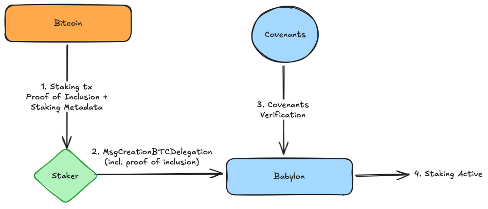
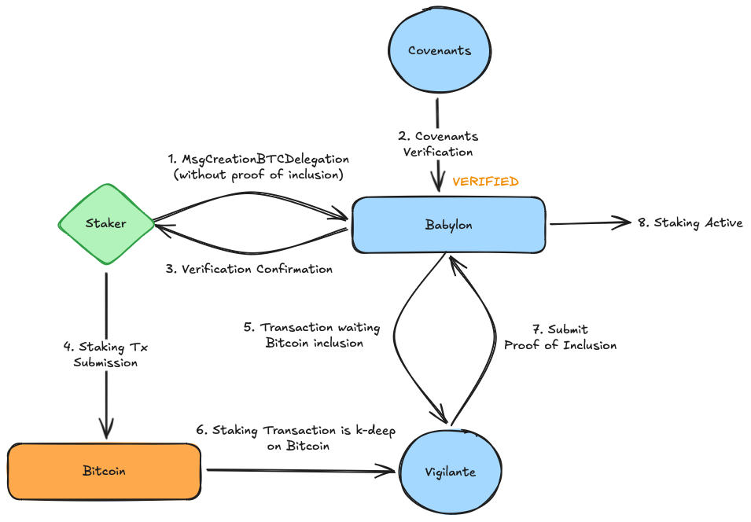

# Bitcoin Stake Registration
## Table of contents
1. [Introduction](#1-introduction)
2. [Bitcoin Stake Registration Methods](#2-bitcoin-stake-registration-methods)
   1. [Post-Staking Registration](#21-post-staking-registration)
   2. [Pre-Staking Registration](#22-pre-staking-registration)
3. [Bitcoin Stake Registration](#3-bitcoin-stake-registration)
   1. [Overview of Data that needs to be Submitted](#31-overview-of-registration-data)
   2. [Babylon Chain BTC Staking Parameters](#32-babylon-chain-btc-staking-parameters)
   3. [Creating the Bitcoin transactions](#33-creating-the-bitcoin-transactions)
   4. [The `MsgCreateBTCDelegation` Babylon message](#34-the-msgcreatebtcdelegation-babylon-message)
   5. [Constructing the `MsgCreateBTCDelegation`](#35-constructing-the-msgcreatebtcdelegation)
4. [Managing your Bitcoin Stake](#4-managing-your-bitcoin-stake)
   1. [On-demand unbonding](#41-on-demand-unbonding)
   2. [Withdrawing Expired/Unbonded BTC Stake](#42-withdrawing-expiredunbonded-bitcoin-stake)
   3. [Withdrawing Remaining Funds after Slashing](#43-withdrawing-remaining-funds-after-slashing)
5. [Bitcoin Staking Rewards](#5-bitcoin-staking-rewards)
   1. [Rewards Distribution](#51-rewards-distribution)
   2. [Rewards Withdrawal](#52-rewards-withdrawal)

## 1. Introduction

This document walks through the communication protocol
with the Babylon chain in order to register Bitcoin stakes.
The document is structured as follows:
- [Section 2](#2-bitcoin-stake-registration-methods) provides an overview
    of the two flows for registering stakes on the Babylon chain.
- [Section 3](#3-bitcoin-stake-registration) describes the data required for stake registration,
    the registration process itself, and the `MsgCreateBTCDelegation` message used
    to communicate staking transactions to the Babylon chain.
- [Section 4](#4-managing-your-bitcoin-stake) details stake management, including
    on-demand unbonding and withdrawal.
- [Section 5](#5-bitcoin-staking-rewards) focuses on the Bitcoin staking rewards
    and how to access them.

**Target Audience**: This document is intended as a reference for technical
readers that intend to implement their own methods for registering Bitcoin stakes
(either ones already on Bitcoin or new ones). Alternative methods of staking
including (or hosting a staking platform) include using the front-end CLI
(running the [simple staking](https://github.com/babylonlabs-io/simple-staking)
reference implementation) or using the
[Staker CLI program](https://github.com/babylonlabs-io/btc-staker).

## 2. Bitcoin Stake Registration Methods

Bitcoin stakes must be registered on the Babylon blockchain
to gain voting power and earn rewards.
This registration process involves
submitting a registration transaction
followed by the validation of the staking operation by key
network components including the Babylon chain CometBFT validators
and the covenant committee.

There are two main methods for registering Bitcoin stakes on the Babylon blockchain:
* **Post-staking registration**: This applies to stakers who have already submitted
  their BTC Staking transaction on the Bitcoin network and then register it on Babylon
  (e.g., phase-1 stakers).
* **Pre-staking registration**: This is for stakers who seek validation from the Babylon
  chain before submitting their staking transaction on Bitcoin and locking their funds,
  ensuring acceptance guarantees (e.g., newly created stakes after the Babylon chain launch).

Each approach is designed to accommodate different staking preferences and
circumstances. In the following sections, we will explore the approaches in more detail.

> **⚡ A Note on `k`-depth**: In the following sections,
> we frequently refer to `k`-depth. The Babylon chain
> only activates staking transactions if they reach `k`-depth,
> where `k` is a Babylon chain parameter defined in the
> [x/btccheckpoint](../x/btccheckpoint) module (as `btc_confirmation_depth`)
> and controlled by governance.
>
> Depth measures how deep a transaction's block is within the Bitcoin blockchain.
> It is calculated as the difference between the Bitcoin tip height and the block
> containing the transaction.
>
> Example: If the Bitcoin tip height is 100, then:
> * Block 99 is 1-deep
> * Block 90 is 10-deep

### 2.1. Post-Staking Registration

This flow applies to stakers whose BTC staking transaction has already
been confirmed in a Bitcoin block that is `k`-deep
and is subsequently registered on the Babylon chain.
For example, this includes participants from a Babylon phase-1 network.

The following diagram illustrates the post-staking registration flow:


Steps:
1. **Generate staking metadata**: Retrieve the staking transaction
   from its included Bitcoin block and generate the proof of inclusion.
2. **Fill the `MsgCreateBTCDelegation` message** with the  unbonding transaction,
  signed slashing transactions and proof of possession (POP) and broadcast it to
  the Babylon blockchain (details on how to do this will be provided in
  [Section 3.4.](#34-the-msgcreatebtcdelegation-babylon-message))
3. **Await Covenant Verification**: The stake will remain in a `PENDING` state until the covenants
   provide their verification signatures.
4. **Activation**: Once a quorum of covenant signatures is reached,
   the stake is designated as `ACTIVE`.

> **⚠️ Critical Warning**: When migrating your stake from Phase-1, it is essential
> to include the proof of inclusion to specify that your stake has already
> been included on the Bitcoin ledger.
> **Failing to provide this proof will make the Babylon node expect**
> **your stake to be included in a later Bitcoin height, leading to**
> **the rejection of any subsequent staking registrations of it**.
> In those cases, the stake will have to be unbonded and staked again.
>
> **⚠️ Important Warning about Finality Providers**: Be cautious when selecting a
> finality provider for your stake. If the finality provider you delegate to gets
> slashed before your stake is registered, your stake may become stuck. This is
> particularly important for Phase-1 stake that is in the process of being
>registered.

### 2.2. Pre-Staking Registration

The Pre-staking registration flow  is for stakers who seek
verification from the Babylon chain before submitting their
BTC staking transaction to the Bitcoin ledger. By doing so,
they gain assurance that their stake will be accepted before
locking their funds on Bitcoin.

The process begins with the staker submitting all relevant staking data
to the Babylon chain. Subsequently, the covenant committee provides
verification signatures for on-demand unbonding and slashing,
giving the staker the required assurance for moving on with broadcasting
their BTC staking transaction. After the transaction is confirmed in
a Bitcoin block that is `k`-deep, the staker
(or an automated service like the
[vigilante watcher](https://github.com/babylonlabs-io/vigilante))
submits a proof of inclusion to finalize the registration
and lead to stake activation.

The following diagram illustrates the pre-staking registration flow:


Steps:
1. **Fill the `MsgCreateBTCDelegation` message** with necessary metadata and
   broadcast it to the Babylon blockchain.
   (details on how to do this
   will be provided in [Section 3.4.](#34-the-msgcreatebtcdelegation-babylon-message))
   > **⚡ Note**: As the staking transaction is not on the Bitcoin ledger yet,
   > the proof of inclusion should be omitted. This signals that the pre-staking
   > registration flow is followed and a proof of inclusion will be submitted later.
2. **Await Covenant Verification**:
   Until then, the stake remains as `PENDING`.
3. **Verification**:
   Once a quorum of signatures is reached, the stake is labeled `VERIFIED`,
   meaning the necessary covenant signatures for slashing and on-demand unbonding are in place.
4. **BTC Staking Submission**: Following verification, the staker signs and broadcasts
   the BTC Staking transaction to the Bitcoin network.
5. **Monitor for Bitcoin Inclusion**: The
   [Vigilante Watcher](https://github.com/babylonlabs-io/vigilante) (or the staker)
   monitors Bitcoin for transaction confirmation and `k`-deep inclusion.
6. **Confirm `k`-deep Inclusion**:
   The vigilante watcher will identify that the transaction is k-deep in the Bitcoin chain.
7. **Submit Proof of Inclusion**:
   Once the transaction is `k`-deep, the vigilante watcher (or the staker) submits
   `MsgAddBTCDelegationInclusionProof`.
   > **⚡ Note**: If you prefer not to rely on the Vigilante Watcher, you can manually track
   > Bitcoin depth and submit this message yourself. Details on the message
   > construction can be found on the [x/btcstaking](../x/btcstaking) module documentation.
   > For the rest of the document, we will assume reliance on the vigilante watcher service
   > for simplicity.
8. **Activation**:
   Upon receiving the proof of inclusion, the stake is marked as active.

> **⚠️ Critical Warning**: After your transaction is confirmed in a Bitcoin block,
> remember to submit the proof of inclusion to complete the registration process.
>
> **⚠️ Important**: Gas Requirements for Pre-staking registration
>
> Since pre-staking registration does not require prior fund commitment
> on Bitcoin, it could be exploited for chain spamming, especially
> due to the multiple covenant signature submissions it triggers.
>
> To mitigate this, submitting a `MsgCreateBTCDelegation` via
> the pre-staking registration flow requires an increased
> minimum gas fees that covers the gas for the staking,
> covenant signatures, and proof of inclusion submissions.
> This mimimum gas is defined by the `delegation_creation_base_gas_fee`
> staking parameter of the Babylon chain
> (this parameter will be detailed in
> [Section 3.2.](#32-babylon-chain-btc-staking-parameters)).
>
> **⚠️ Important Warning about Finality Providers**: Be cautious when selecting a
> finality provider for your stake. If the finality provider you delegate to gets
> slashed before your stake is registered, your stake may become stuck. This is
> particularly important for Phase-1 stake that is in the process of being
>registered.

## 3. Bitcoin Stake Registration

### 3.1. Overview of Registration Data

Registering a Bitcoin stake on the Babylon chain requires submitting the
staking transaction along with essential metadata.
This section provides an overview of the required data,
while later sections detail how to create and package it into a
Babylon registration transaction.

**Key Registration Data**:
* **BTC Staking Transaction**: The Bitcoin transaction that locks the Bitcoin stake
  in the self-custodial Bitcoin staking script. It can be submitted signed or unsigned,
  depending on the staking flow and UTXO inputs.
* **Unbonding Transaction**: An *unsigned* unbonding transaction allowing
  the staker to on-demand unbond their stake. It is submitted to the Babylon chain
  and co-signed by the covenants upon verification.
* **Slashing Transactions**: Two staker pre-signed slashing transactions
  (one for staking, one for unbonding) that ensure enforcement
  of slashing if the finality provider to which the stake is delegated to
  double-signs. They are submitted to the Babylon chain and co-signed
  by the covenants upon verification.
* **Proof of Possession**: Confirms ownership of the Bitcoin key
  by the Babylon account used for stake registration.
* **Merkle Proof of Inclusion**: Verifies transaction inclusion in a Bitcoin
  block that is `k`-deep. Submitted during initial registration in the post-staking
  registration flow or later in the pre-staking registration flow.

> **⚠️ Critical Warning**: The proof of inclusion is a vital part of your
> registration data.
> Ensure it is included to verify your stake's origin from past Bitcoin
> block heights. Failure to include it will lead to your
> stake needing to unbond and be staked again.
>
> **⚡ Note**: More details on the Bitcoin staking, unbonding, and slashing
> transactions can be found in the
> [Bitcoin Staking script specification](./staking-script.md).
>
> **⚠️ Important Warning about Finality Providers**: Be cautious when selecting a
> finality provider for your stake. If the finality provider you delegate to gets
> slashed before your stake is registered, your stake may become stuck. This is
> particularly important for Phase-1 stake that is in the process of being
> registered.

Once assembled, this data is packaged into a Babylon chain transaction and
broadcast to the network. The process differs based on whether the staker
follows the pre-staking or post-staking registration flow.

**Upcoming Sections**:
* Required parameters for BTC Staking transactions.
* Construction of Bitcoin transactions for staking.
* Building the Babylon chain transaction with required staking data.
* Submitting the registration transaction to the Babylon chain.

### 3.2. Babylon Chain BTC Staking Parameters

BTC Staking transactions must adhere to parameters defined by the Babylon chain,
which vary based on Bitcoin block heights. Each parameters version
is defined by a `btc_activation_height`, determining the Bitcoin height
from which the parameters version takes effect.
To determine the applicable parameter version for a staking taking
effect at Bitcoin block height `lookup_btc_height`:
1. Sort all parameters versions by `btc_activation_height` in ascending order.
2. The first parameters version with `lookup_btc_height >= btc_activation_height`
   applies to the staking.

Below is an overview of the key staking parameters contained in the different
versions managed by the [x/btcstaking](../x/btcstaking) module:

* `covenant_pks`:
  BIP-340 public keys of the covenant committee (64-character hex strings).
  The public keys are an x-coordinate only
  representation of a secp256k1 curve point as the y-coordinate is implied.
* `covenant_quorum`:
  The minimum number of signatures to achieve a covenants quorum.
* `min_staking_value_sat` / `max_staking_value_sat`:
  The minimum/maximum Bitcoin stake in satoshis (smallest unit of Bitcoin).
* `min_staking_time_blocks` / `max_staking_time_blocks`:
  The minimum/maximum Bitcoin staking duration (in Bitcoin blocks).
* `slashing_pk_script`:
  The `pk_script` expected in the first output of the slashing transaction.
  It is stored as a sequence of bytes, representing
  the conditions for spending the output.
* `min_slashing_tx_fee_sat`:
  The minimum transaction fee (in satoshis) required for the pre-signed slashing
  transaction.
* `slashing_rate`: A scalar specifying the percentage of stake
  slashed if the finality provider double-signs.
* `unbonding_time_blocks`:
  The on-demand unbonding time in Bitcoin blocks.
* `unbonding_fee_sat`:
  The Bitcoin fee in satoshis required for unbonding transactions.
* `min_commission_rate`: A scalar defining the minimum commission rate
  for finality providers.
* `delegation_creation_base_gas_fee`: Defines the minimum
  gas fee to be paid when registering a stake through the pre-staking
  registration flow.
* `allow_list_expiration_height`: The Babylon block height
  on which the initial staking transaction allow-list expires.
  More details on the allow list can be found [here](./phase1-stake-registration-eligibility.md).
* `btc_activation_height`: The Bitcoin block height on which this parameters version
  takes effect.


> **⚡ Retrieving Staking Parameters**
>
> These parameters are part of the [x/btcstaking](../x/btcstaking)
> module parameters can be queried via a Babylon node using
> RPC/LCD endpoints or the CLI.
>
> **⚠️  Warning**: Make sure that you are retrieving the BTC Staking parameters
> from a trusted node and you verify their authenticity using additional
> sources. Failure to use the correct BTC Staking parameters might make your
> stake unverifiable or temporarily frozen on Bitcoin (in the case of an
> invalid covenant emulation committee). 

> **⚡ Choosing the Correct Staking Parameters**
>
> Stakers must ensure that their Bitcoin transaction adheres
> to the correct parameters based on the registration flow
> that is followed:
>
> * **Post-staking registration flow**: Use parameters corresponding to
>   the Bitcoin block height in which the staking transaction is included
>   (similar to phase-1).
> * **Pre-staking registration flow**: Use the parameters matching the
>   **Babylon on-chain Bitcoin light client** at the time of pre-staking
>   registration. This ensures that the transaction commits to be validated
>   against the current staking parameters version (as observed by the Babylon chain).
>   This ensures that the pre-staking registered transaction will remain valid even if
>   it is later included
>   in a Bitcoin block for which different parameters take effect,
>   The on-chain Bitcoin light client tip height can be retrieved by querying
>   the [x/btclightclient](../x/btclightclient) module using RPC/LCD endpoints
>   or the CLI.

### 3.3. Creating the Bitcoin transactions

The Bitcoin staking parameters from the previous section are used
to create the necessary Bitcoin transactions for registering
a Bitcoin stake on the Babylon and Bitcoin ledgers.
These transactions include:
* **BTC Staking Transaction**: The Bitcoin transaction that locks
  the stake in the self-custodial Bitcoin staking script.
* **Slashing Transaction**: A pre-signed transaction consenting
  to slashing in case of double-signing.
* **Unbonding Transaction**: The on-demand unbonding transaction used to
 unlock the stake before the originally committed timelock expires.
* **Unbonding Slashing Transaction**: A pre-signed transaction consenting
  to slashing during the unbonding process in case of double-signing.

You can create these transactions using:
* [The Golang BTC staking library](../btcstaking)
* [The TypeScript BTC staking library](https://github.com/babylonlabs-io/btc-staking-ts)
* Your own implementation following the
  [Bitcoin staking script specification](./staking-script.md).

> **⚡ Note**: Ensure you use the valid Babylon parameters when creating
> the Bitcoin transactions.

### 3.4. The `MsgCreateBTCDelegation` Babylon message

Cosmos SDK transactions are used for registering
BTC delegations on the Babylon chain.
The `MsgCreateBTCDelegation` message
bundles the necessary staking data and registers
the Bitcoin stake on the Babylon blockchain.

#### Key Fields in `MsgCreateBTCDelegation`

```protobuf
// MsgCreateBTCDelegation is the message for creating a BTC delegation
message MsgCreateBTCDelegation {
  option (cosmos.msg.v1.signer) = "staker_addr";
  // staker_addr is the address to receive rewards from BTC delegation.
  string staker_addr = 1 [(cosmos_proto.scalar) = "cosmos.AddressString"];
  // pop is the proof of possession of btc_pk by the staker_addr.
  ProofOfPossessionBTC pop = 2;
  // btc_pk is the Bitcoin secp256k1 PK of the BTC delegator
  bytes btc_pk = 3 [ (gogoproto.customtype) = "github.com/babylonlabs-io/babylon/types.BIP340PubKey" ];
  // fp_btc_pk_list is the list of Bitcoin secp256k1 PKs of the finality providers, if there is more than one
  // finality provider pk it means that delegation is re-staked
  repeated bytes fp_btc_pk_list = 4 [ (gogoproto.customtype) = "github.com/babylonlabs-io/babylon/types.BIP340PubKey" ];
  // staking_time is the time lock used in staking transaction
  uint32 staking_time = 5;
  // staking_value  is the amount of satoshis locked in staking output
  int64 staking_value = 6;
  // staking_tx is a bitcoin staking transaction i.e transaction that locks funds
  bytes staking_tx = 7 ;
  // staking_tx_inclusion_proof is the inclusion proof of the staking tx in BTC chain
  InclusionProof staking_tx_inclusion_proof = 8;
  // slashing_tx is the slashing tx
  // Note that the tx itself does not contain signatures, which are off-chain.
  bytes slashing_tx = 9 [ (gogoproto.customtype) = "BTCSlashingTx" ];
  // delegator_slashing_sig is the signature on the slashing tx by the delegator (i.e., SK corresponding to btc_pk).
  // It will be a part of the witness for the staking tx output.
  // The staking tx output further needs signatures from covenant and finality provider in
  // order to be spendable.
  bytes delegator_slashing_sig = 10 [ (gogoproto.customtype) = "github.com/babylonlabs-io/babylon/types.BIP340Signature" ];
  // unbonding_time is the time lock used when funds are being unbonded. It is be used in:
  // - unbonding transaction, time lock spending path
  // - staking slashing transaction, change output
  // - unbonding slashing transaction, change output
  // It must be smaller than math.MaxUInt16 and larger that max(MinUnbondingTime, CheckpointFinalizationTimeout)
  uint32 unbonding_time = 11;
  // fields related to unbonding transaction
  // unbonding_tx is a bitcoin unbonding transaction i.e transaction that spends
  // staking output and sends it to the unbonding output
  bytes unbonding_tx = 12;
  // unbonding_value is amount of satoshis locked in unbonding output.
  // NOTE: staking_value and unbonding_value could be different because of the difference between the fee for staking tx and that for unbonding
  int64 unbonding_value = 13;
  // unbonding_slashing_tx is the slashing tx which slash unbonding contract
  // Note that the tx itself does not contain signatures, which are off-chain.
  bytes unbonding_slashing_tx = 14 [ (gogoproto.customtype) = "BTCSlashingTx" ];
  // delegator_unbonding_slashing_sig is the signature on the slashing tx by the delegator (i.e., SK corresponding to btc_pk).
  bytes delegator_unbonding_slashing_sig = 15 [ (gogoproto.customtype) = "github.com/babylonlabs-io/babylon/types.BIP340Signature" ];
}
```
#### Explanation of Fields

* `staker_addr`:
  A Bech32-encoded Babylon address (`bbn...`) representing the
  staker's Babylon account where staking rewards will be accumulated.
  *This should be the same address that signs the registration transaction*.
* `pop` (Proof of Possession):
  A cryptographic signature proving that the submitter of the registration
  transaction is the owner of the Bitcoin private key used for staking.
  * `btc_sig_type`: Specifies the signature algorithm used.
    The options are:
    * `0` for [BIP-340 (Schnorr Signatures)](https://github.com/bitcoin/bips/blob/master/bip-0340.mediawiki)
    * `1` for [BIP-322 (Generic Signing format)](https://github.com/bitcoin/bips/blob/master/bip-0322.mediawiki)
      * Note that the [simple](https://github.com/bitcoin/bips/blob/master/bip-0322.mediawiki#simple) signature format is used.
    * `2` for [ECDSA (Elliptic Curve Digital Signature Algorithm)](https://github.com/bitcoin/bips/blob/master/bip-0137.mediawiki)
  * `btc_sig`: The signature generated by signing the staker address using the
    chosen algorithm. The verification process differs by algorithm:
  * **BIP-340**: The hash of the staker address bytes should be signed.
  * **BIP-322**: Bytes of the bech32 encoded address should be signed.
  * **ECDSA**: Bytes of the bech32 encoded address should be signed.

  ```protobuf
  message ProofOfPossessionBTC {
      // btc_sig_type indicates the type of btc_sig in the pop
      BTCSigType btc_sig_type = 1;
      // btc_sig is the signature generated via sign(sk_btc, babylon_staker_address)
      // the signature follows encoding in either BIP-340 spec or BIP-322 spec
      bytes btc_sig = 2;
  }
  ```
* `btc_pk`:
  This Bitcoin `secp256k1` public key of the BTC staker,
  in BIP-340 format (Schnorr signatures). It is a compact, 32-byte
  value derived from the staker's private key. This public key corresponds to
  the staker public used to construct the [staking script](./staking-script.md) used
  in the BTC Staking transaction.
* `fp_btc_pk_list`:
  A list of the `secp256k1` public keys of the finality providers
  (FPs) to which the stake is delegated in BIP-340 format (Schnorr signatures)
  and compact 32-byte representation.
  **For phase-2,
  this list contains a single key,
  since Babylon is the only system secured by the Bitcoin stake**.
  The public key should be exactly the same as the one
  used when constructing the [staking script](./staking-script.md).
* `staking_time`:
  The duration of staking in Bitcoin blocks. This is the same
  as the timelock used when constructing the [staking script](./staking-script.md)
  and must comply with the Babylon staking parameters.
* `staking_value`:
  The amount of satoshis locked in the staking output of the BTC
  staking transaction (`staking_tx`). This value must precisely match the Bitcoin
  amount in the staking transaction.
* `staking_tx`:
  The Bitcoin staking transaction in hex format. This transaction locks
  the Bitcoin funds in the staking output and it is crucial that it follows
  precisely the [staking script](./staking-script.md) format using the
  correct Bitcoin staking parameters. Some of the values included in the
  `MsgCreateBTCDelegation` should match with the values in the staking transaction.
  > **⚠️ Important: Should the Inputs of the Staking Transaction be Signed?**
  >
  > Whether the staking transaction should include signed or unsigned
  > UTXO inputs depends on the type of inputs used.
  > Since the Babylon chain tracks staking transactions based on
  > their transaction hash, it's crucial for the staker to submit
  > the staking transaction in a format that contains all the
  > necessary data to generate the full hash corresponding
  > to the fully signed transaction.
  >
  > For legacy inputs that require the `script_sig` field to be filled,
  > the signature **must** be included when submitting the
  > transaction to Babylon, as this field directly influences
  > the transaction hash.
  >
  > On the other hand, for inputs that require the `witness` field
  > (e.g., SegWit inputs), the signature **does not** need to be
  > included as part of the transaction.
  >
  > While this distinction doesn't affect the guarantees of staking
  > transactions following the post-staking registration flow
  > (since stakes are first committed to Bitcoin), stakers opting
  > for the pre-staking registration flow must ensure that any legacy inputs
  > (which require the `script_sig` field) must submit the staking transaction
  > as **fully signed**.
  >
  > For example, if a staker creates a staking transaction with multiple inputs,
  > and at least one of them is a legacy input, the transaction should be submitted
  > such that:
    > * Legacy inputs have their `script_sig` field filled with the signature.
    > * Other inputs, such as SegWit inputs, can be provided without the witness
    >   to minimize costs.
  >
  > The downside to this is that by submitting a fully signed
  > staking transaction, there is a risk of it being propagated
  > to Bitcoin prematurely, before receiving the covenant signatures
  > (i.e., same as with post-staking registration which is first
  > on Bitcoin before receiving covenant verification).
  > However, some stakers might still choose the pre-staking
  > registration flow, as it requires less waiting time
  > (if the staker chooses to rely on the vigilante watcher)
  > compared to the post-staking registration flow.
* `staking_tx_inclusion_proof` (Optional):
  A merkle proof showing the staking transaction's inclusion in `k`-deep
  Bitcoin block. This field should be filled in when going through
  the post-staking registration flow and left empty when going through
  The field is defined as an `InclusionProof` protobuf data type (specified below)
  with the following fields:
  ```proto
  // in x/btccheckpoint module types
  message TransactionKey {
    uint32 index = 1;
    bytes hash = 2
      [ (gogoproto.customtype) =
      "github.com/babylonlabs-io/babylon/types.BTCHeaderHashBytes" ];
  }

  // in x/btcstaking module types
  message InclusionProof {
      // key is the position (txIdx, blockHash) of this tx on BTC blockchain
      babylon.btccheckpoint.v1.TransactionKey key = 1;
      // proof is the Merkle proof that this tx is included in the position in `key`
      bytes proof = 2;
  }

  ```
  * `key`: Identifies the transaction's position in the Bitcoin blockchain.
    The key should correspond to the `TransactionKey` type,
    which contains two fields:
    * `txIdx`: The index of the transaction within the block (e.g., tx number 42).
    * `blockHash`: The hash of the block containing the transaction.
  * `proof`: A Merkle proof verifying the transaction's inclusion in the Bitcoin chain.
    It is a list of transaction hashes the staking transaction hash is paired with
    (recursively), in order to trace up to obtain the merkle root of the block, deepest
    pairing first. Some resources on constructing the proof:
    * [Merkle Proof specification](https://electrumx.readthedocs.io/en/latest/protocol-methods.html#blockchain-transaction-get-merkle)
    * [Golang implementation](https://github.com/babylonlabs-io/btc-staker/blob/v0.15.1/babylonclient/utils.go#L10)
    * [TypeScript implementation](https://github.com/babylonlabs-io/btc-staking-ts/blob/de1d1cff3ef4ad45b5c61f0d7b11fd4479de278a/src/staking/manager.ts#L760)
* `slashing_tx` / `delegator_slashing_sig`:
  The slashing transaction that spends the BTC staking transaction through the
  slashing path and the staker's BIP-340 (Schnorr) signature for it.
  Both are in hex format.
  This transaction is considered fully signed once it has signatures
  from the staker, a quorum of the covenants, and the finality provider.
  Upon transaction verification, the covenant signatures are added,
  meaning that only the finality provider's signature is missing.
  According to the BTC Staking protocol,
  if the finality provider double-signs,
  its private key is exposed, leading to the full signature set.
* `unbonding_time`:
  The on-demand unbonding period measured in Bitcoin blocks.
  This is the same as the timelock used when constructing
  the [unbonding script](./staking-script.md)
  and must comply with the Babylon staking parameters.
* `unbonding_tx`:
  The unsigned unbonding transaction in hex format. The submission of the unbonding
  transaction is a requirement in order to (1) receive a quorum of covenant
  signatures for the unbonding transaction and (2)
  for the verification of the slashing transaction that spends the unbonding one.
* `unbonding_value`:
  The amount of satoshis committed to the unbonding output of the unbonding transaction.
* `unbonding_slashing_tx` / `delegator_unbonding_slashing_sig`:
  The slashing transaction that spends the on-demand unbonding transaction through the
  slashing path and the staker's BIP-340 (Schnorr) signature for it.
  Both are in hex format.
  This transaction has the same properties with the `slashing_tx`,
  with the difference that it spends the
  slashing path of the on-demand unbonding transaction.

### 3.5. Constructing the `MsgCreateBTCDelegation`

There are multiple ways to construct and broadcast the `MsgCreateBTCDelegation`
message to the Babylon network:
* **Command line interface (CLI)**:
  Use the `babylond tx btcstaking create-btc-delegation` command.
* **TypeScript Implementation**:
  Generate the message using TypeScript following
  this [reference implementation](
  https://github.com/babylonlabs-io/simple-staking/blob/2b9682c4f779ab39562951930bc3d023e5467461/src/app/hooks/services/useTransactionService.ts#L672-L679)
  and broadcast to the Babylon network.
* **Golang Implementation**:
  Construct the message using Golang based on this
  [type reference](../x/btcstaking/types/tx.pb.go)
  and broadcast to the Babylon network.
* **External References**:
  For detailed instructions on broadcasting transactions,
  refer to the external
  [Cosmos SDK documentation](https://docs.cosmos.network/main/learn/advanced/transactions#broadcasting-the-transaction).

> **⚠️ Important**:
> * Phase-1 staking transactions using the post-staking registration flow will
>   only be accepted if they meet
>   [these eligibility criteria](./phase1-stake-registration-eligibility.md).
> * New phase-2 staking registration, whether created
>   through the pre-staking or post-staking registration flow,
>   will only be accepted once the allow-list expires.

## 4. Managing your Bitcoin Stake

### 4.1. On-demand Unbonding

On-demand unbonding allows stakers to initiate the unbonding
of their staked BTC before the original timelock they have committed
to in the original staking transaction expires. The funds become
available for withdrawal after an unbonding period specified
in the Babylon parameters (see [Section 3.2.](#32-babylon-chain-btc-staking-parameters)).

To on-demand unbond, stakers must submit the same on-demand unbonding
transaction they registered as part of their stake earlier,
but only after adding the required signatures:
* The staker's signature, and
* A quorum of covenant signatures

The covenant signatures are recorded and committed on-chain as part
of the stake activation process. A stake **will not be activated**
(or verified, in the case of pre-staking registration)
unless it has received a quorum of covenant signatures for unbonding.

To retrieve the unbonding transaction and add the necessary signatures,
follow these steps:
1. **Retrieve the unbonding transaction and covenant signatures**
   by querying the Babylon ledger (e.g., through the RPC/LCD or CLI).
2. **Add your own signature** to the unbonding transaction witness.
3. **Add the covenant signatures** to the unbonding transaction witness.
4. **Broadcast the fully signed transaction** to the Bitcoin network.

For a practical example of how to construct the add the signatures
to construct a fully signed unbonding transaction,
refer to:
* [the TypeScript library documentation](https://github.com/babylonlabs-io/btc-staking-ts?tab=readme-ov-file#create-unbonding-transaction)
* [the Golang staking library utils](../btcstaking/witness_utils.go)

> **⚡ Note: Unbonding notification on the Babylon chain**
>
> The Babylon system employs
> the [Vigilante Unbonding Watcher](https://github.com/babylonlabs-io/vigilante),
> a service that monitors the Bitcoin ledger for **on-demand unbonding transactions**
> and reports them back to the Babylon chain. Once the unbonding transaction
> is included Bitcoin, the vigilante detects it and notifies Babylon,
> causing the stake to lose its voting power.

### 4.2. Withdrawing Expired/Unbonded Bitcoin Stake

The withdrawal process involves submitting a Bitcoin transaction
that transfers staked BTC from Babylon protocol output (either staking or
unbonding or change from slashing) to the address under staker wallet control,
once its timelock has expired.

The process involves the following steps:
1. Retrieve the staking/unbonding transaction with the
   expired timelock.
2. Construct a withdrawal transaction signed by the staker.
3. Submit the transaction to the Bitcoin blockchain.

For a practical example of how to construct the withdrawal transaction,
refer to:
* [the TypeScript library documentation](https://github.com/babylonlabs-io/btc-staking-ts?tab=readme-ov-file#withdrawing)
* [the Golang staking library utils](../btcstaking/witness_utils.go)

### 4.3. Withdrawing Remaining Funds after Slashing

Bitcoin stake is slashed if the finality provider to
which it was delegated to double-signs. Slashing involves
broadcasting a [slashing transaction](./staking-script.md)
that sends a portion of the slashed funds to a burn address
(as defined in the staking params in [Section 3.2.](#32-babylon-chain-btc-staking-parameters)),
while the remaining funds are transfered to a timelock script,
which can later be withdrawn using the same withdrawal process
defined in the previous section.

To determine the slashing timelock, refer to the `unbonding_time_blocks`
parameter in the [Babylon Chain BTC Staking Parameters](32-babylon-chain-btc-staking-parameters). Babylon ensures that the timelock on the change output of a slashing
transaction matches the unbonding time. Therefore, the unbonding time
parameter effectively represents your slashing timelock. The reasoning behind
the timelock is that we want to avoid situation in which some finality providers
could use slashing as a way to unbond instantly.

## 5. Bitcoin Staking Rewards

Bitcoin stakers are rewarded with native tokens from
the chain they help secure, in exchange for the economic security
they provide.

### 5.1. Rewards Distribution

The rewards are distributed as follows:
* A fixed number of native tokens are minted upon the creation of each new block.
* The minted rewards are allocated among three groups:
  * Native stakers
  * Bitcoin stakers
  * Community pool

  The allocation is controlled by specific parameters:
  * **Bitcoin Stakers Portion**: Defined by the `btc_staking_portion` parameter,
    which specifies the portion of rewards allocated to Bitcoin stakers. This is
    calculated based on the voting power and commission rate of the finality
    provider the stake has been delegated to.
  * **Community Pool Portion**: Typically defined in the `x/distribution`
    module of the Cosmos SDK, often referred to as the community tax.
  * **Native Stakers Portion**: The remaining rewards, after allocations to
    Bitcoin stakers and the community pool, are distributed to native stakers.

* Rewards for Bitcoin stakers are further distributed based on the voting power
  and commission rate of the finality provider the stake has been delegated to.
  The rewards are entered into a gauge, which stakers can query and withdraw
  from through a transaction submission.
* Rewards are distributed when a block is finalized. The system processes
  finalized blocks to ensure that all eligible stakers receive their rewards
  based on the voting power and commission rates at the time of finalization.

### 5.2. Rewards Withdrawal

Rewards can be withdrawn by submitting a `MsgWithdrawReward` message:
```protobuf
// MsgWithdrawReward defines a message for withdrawing reward of a stakeholder.
message MsgWithdrawReward {
    option (cosmos.msg.v1.signer) = "address";
    // type is the stakeholder type {finality_provider, btc_staker}
    string type = 1;
    // address is the address of the stakeholder in bech32 string
    // signer of this msg has to be this address
    string address = 2;
}
```

The message defines the following fields:
* `type`: Specifies the stakeholder type for reward withdrawal. Allowed values:
  * `finality_provider`
  * `btc_staker`
* `address`: The bech32 address of the stakeholder
  (must match the signer of the message).

**Submitting the Withdrawal Transaction**:
Rewards can be withdrawn by:
* Submitting the `MsgWithdrawReward` via any RPC/LCD node
* Using the CLI `babylond tx incentive withdraw-reward <type>`
* You can claim rewards programmatically using the
  TypeScript implementation. Please refer to the [TypeScript claim rewards implementation](https://github.com/babylonlabs-io/simple-staking/blob/main/src/app/hooks/services/useRewardsService.ts#L49).

**Querying for available rewards**:
Rewards can be checked using the `x/incentive` module:
* **via an RPC/LCD query**
  on the URL `/babylon/incentive/address/{address}/reward_gauge`,
  where `address` is the bech32 address of the staker.
* **via the CLI command**
  `babylond query incentive reward-gauges <bech32-address>`
* **via TypeScript**: You can use the TypeScript implementation to query rewards.
Please refer to the [TypeScript library documentation](https://github.com/babylonlabs-io/simple-staking/blob/main/src/app/hooks/client/rpc/queries/useBbnQuery.ts).
