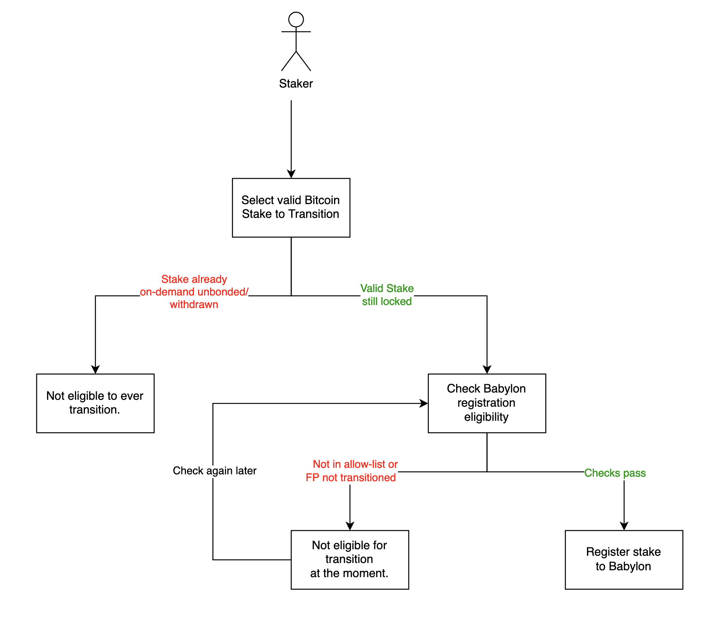

# Transition of Existing Stakes to the Babylon Chain

This document is intended for Bitcoin stakers who have
submitted confirmed Bitcoin staking transactions
on the Bitcoin blockchain before the launch of
the phase-2 Babylon blockchain (e.g., via participation
in one of the phase-1 networks).
It outlines the eligibility criteria for the registration of
the stakes, as well as the required data to submit to the
Babylon blockchain to gain voting power and start earning
rewards.

> **⚡ Note:**: Each Babylon blockchain network is associated
> with a Bitcoin network (e.g.,
> test environments connect to the BTC signet,
> while production connects to the BTC mainnet).
> For the remainder of the document, we will
> assume that you are registering a stake that
> has been created on the corresponding Bitcoin network
> with the expected parameters (e.g.,
> for phase-2 testnet, registering stakes from phase-1 testnet).

## Registration Eligibility

Bitcoin stakers can hold multiple stakes. The following
flowchart outlines the criteria for each stake's transition.
Note that eligibility is assessed on a
*per-stake* basis, meaning that some stakes
may be eligible for registration while others are not.

The following subsections explain the different
conditions presented in the diagram.

#### Stake Validity

A stake is valid and eligible for registration on the Babylon blockchain if
it meets the following criteria:
1. **Confirmed on the Bitcoin ledger**:
   The staking transaction must have received sufficient
   Bitcoin confirmations to be considered final.
   The Babylon blockchain defines this in its
   [module parameters](../proto/babylon/btccheckpoint/v1/params.proto)
   (expected to be set to 10 confirmations for testnets and mainnet).
2. **Compliance with Staking Parameters**:
   Staking transactions must adhere to the Bitcoin block-range parameters
   defined by the Babylon blockchain, which are consistent with those of
   the Phase-1 system (e.g., covenant keys, and minimum and maximum stake requirements).
   Valid stakes include:
   1. **Active stakes**: As classified by the phase-1 system.
   2. **Overflow stakes**: Stakes that were valid but did not fit within phase-1
      staking caps will be accepted in phase-2.
   3. **Stakes with malformed OP_RETURN**: Transactions rejected in phase-1
      due to malformed `OP_RETURN` outputs are still valid for the Babylon blockchain
      if they meet all other criteria. Unlike phase-1, the Babylon blockchain
      does not require or check `OP_RETURN` outputs.

#### Stake in the Allow-List

To ensure a secure and controlled onboarding of existing stakes
and the creation of new ones,
the Babylon blockchain employs an initial stake ingestion policy.
This is implemented via an allow-list that specifies which staking
transactions can be registered by their transaction hashes.

It has two important properties:
* **Hardcoded Allow-List**: This list is embedded in the Babylon blockchain
  codebase and is visible to all users.
* **Automatic Expiration**: The allow-list functionality has a fixed expiration
  date to prevent abuse.

The allow-list contents and its expiration date will be chosen
according to the network policies (e.g., test environments
might have different policies than mainnet ones).

#### Finality Provider Registration

The Babylon blockchain only accepts stakes that delegate to finality
providers registered on the chain. Finality providers from phase-1
must register anew in phase-2 before their delegators' stakes
can transition.

If that is you, learn how to set up your Babylon blockchain
finality provider stack and how to register
**If you are a finality provider**,
follow the 
[registration guide](https://github.com/babylonlabs-io/finality-provider/blob/main/docs/finality-provider-operation.md)
to set up your finality provider stack and register on the Babylon blockchain.

## Stake Registration Process

Registering an eligible stake involves submitting your Bitcoin staking
transaction and supplementary data to the Babylon blockchain.
Key data include:
1. **Staking Transaction and Merkle Proof**: Proof that the staking 
   transaction was confirmed in a valid Bitcoin block.
2. **Pre-Signed Slashing Transaction**: The staker pre-signs a
   slashing transaction, indicating their consent to slashing.
   Note that this transaction
   still requires the finality provider's and covenant emulators' signatures
   in order to be broadcast on Bitcoin, with the full signature set becoming
   available in the case of finality provider misbehaviour. More on that
   [here](./staking-script.md).
3. **Unsigned On-Demand Unbonding Transaction**:
   This transaction will be pre-signed by the covenants emulators on stake activation
   so that you can unbond at any time.
4. **Pre-Signed On-Demand Unbonding Slashing Transaction**:
   This is a similar slashing
   transaction as with (2), with the difference that it slashes the funds that
   are in the process of being on-demand unbonded. This pre-signed slashing
   transaction ensures protection against timing attacks during unbonding.
5. **Association of Bitcoin and Babylon accounts**:
   A proof of possession associating the Bitcoin key that controls your stake
   with the Babylon chain account which you would like to receive the network
   rewards in.

This data is submitted as a transaction on the Babylon blockchain,
requiring native Babylon blockchain funds for transaction fees.
Full details on the staking transaction format
and data requirements are available in the
[`x/btcstaking` module specification](../x/btcstaking).

## Frequently Asked Questions (FAQ)

### What if I do not want to consent to slashing?

Consenting to slashing is a required for your stake
to receive voting power on the Babylon blockchain.
Slashing is the primary mechanism for deterring and punishing
equivocation.
If you do not want to consent to slashing, you are encouraged
to unbond as soon as possible.
The staking system will allow stakers that do not
wish to consent to slashing and register their stakes
on the Babylon chain
to on-demand unbond any time.

### Can I create new stakes after the Babylon blockchain launch?

Yes, you can create and register new stakes post-launch after
the allow-list has expired.
Unlike phase-1 staking, Babylon now offers an option
to verify a stake's validity *before* locking it on Bitcoin.
This avoids locking funds without proper verification by
the chain. For more details, see the
[`x/btcstaking` module specification](../x/btcstaking).
