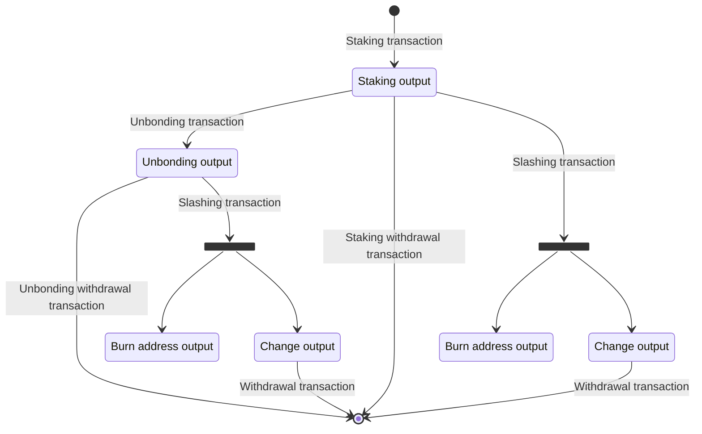

# Bitcoin Staking Transactions Specification

## Table of contents
1. [Introduction](#1-introduction)
2. [Preliminaries](#2-preliminaries)
    1. [Building Blocks](#21-building-blocks)
    2. [Stakeholders](#22-stakeholders)
3. [BTC Staking Protocol Transactions](#3-btc-staking-protocol-transactions)
    1. [The Staking Output](#31-the-staking-output)
    2. [The Unbonding Output](#32-the-unbonding-output)
    3. [The Slashing Refund Output](#33-the-slashing-refund-output)

## 1. Introduction

The Babylon BTC Staking protocol turns Bitcoin into a staking asset,
aiming to onboard both the asset and its holders to the
Bitcoin Supercharged Networks (BSNs) ecosystem and the Babylon Genesis
chain (the first BSN).

Bitcoin holders can stake their BTC by locking it using a
special transaction on the Bitcoin network.
Once locked, the Bitcoin contributes to the economic security of
BSNs selected to be secured,
which in turn enables new opportunities for stakers,
such as earning staking yields.

This document specifies the structure of the transactions involved
in the BTC Staking protocol.
These transactions must conform to a defined format and
commit to specific Taproot scripts.
The values in these scripts are governed by
parameters defined on the Babylon Genesis chain and
the staker's selections.

> ⚡ For information on retrieving Babylon Genesis parameters and
> registering valid staking transactions,
> refer to the
> [registering Bitcoin stakes documentation](./register-bitcoin-stake.md)

## 2. Preliminaries

### 2.1. Building Blocks

The Bitcoin Staking protocol transaction specification is
heavily based on Bitcoin's
[Taproot upgrade](https://github.com/bitcoin/bips/blob/master/bip-0341.mediawiki),
which introduced
[Schnorr signatures](https://github.com/bitcoin/bips/blob/master/bip-0340.mediawiki).

### 2.2. Stakeholders

The Bitcoin Staking protocol involves the following stakeholders:
* **Bitcoin Staker**:
  The Bitcoin staker is the controller and beneficiary of the
  Bitcoin stake once it is created.
  The staker is identified by their Bitcoin public key
  (referenced as `<StakerPk>` in the staking scripts).
  > ⚡ The staker public key does not need to match the UTXO funder of the
  > staking transaction. The funding UTXO can originate from any source,
  > including multi-sig, MPC, or threshold-controlled accounts.
* **Finality Providers**:
  Bitcoin Staking supports delegated staking,
  allowing voting power from a stake to be assigned
  to a finality provider.
  A finality provider is identified by their EOTS public
  key (`<FinalityProviderPk>`) and participates in the finality
  voting round of a specific BSN.
 The selection of finality providers determines which BSNs they secure,
 as each provider may only secure one BSN. Bitcoin stakers can now delegate
 to multiple finality providers across different BSNs by including their
 EOTS keys in the staking script.
> ⚡ Multi-staking across BSNs is now supported. The system enforces that
> at least one finality provider must secure the Babylon Genesis chain,
> with at most one finality provider per consumer chain/BSN. This allows
> BTC stakers to provide security to multiple networks simultaneously
> while maintaining proper validation constraints.
* **Covenant Committee**:
  The role of the covenant committee (identified
  by the Bitcoin public keys of its members `CovenantPk1..CovenantPkN`)
  is to protect BSNs against attacks from the BTC stakers and finality providers.
  It achieves this by representing itself as an M-out-of-N multi-signature
  that co-signs BTC transactions with the BTC staker. Through co-signing,
  the covenant committee enforces spending rules on the staked Bitcoin,
  so that they can only be spent in a protocol compliant manner.
  The co-signatures are published on the Babylon Genesis chain and
  are a pre-requisite for the stake's activation.
  There's no way the covenant committee can act against the stakers,
  except rejecting their staking requests.
* **Babylon Genesis chain**:
  The Babylon Genesis chain is the first BSN and acts as the control layer
  for the BTC staking protocol. All Bitcoin stakes and finality providers
  must be registered on the Babylon Genesis chain.
  It is also responsible for propagating staking-related data to other BSNs.

> ⚠️ Staking scripts must not contain duplicate keys.
> The public keys for `StakerPk`, `FinalityProviderPk`, and each `CovenantPk`
> must be unique within a single stake.

## 3. BTC Staking Protocol Transactions

The Bitcoin Staking protocol defines four key transaction types:
* **Staking Transaction**:
  A staking transaction is a Bitcoin
  transaction that locks a specific amount of BTC into
  the Babylon-recognized staking script.
  It marks the beginning of a BTC staking lifecycle.
  The requirements for a valid staking transaction are:
  * It can contain an arbitrary number of inputs.
  * It can contain an arbitrary number of outputs,
    with the requirement that at least one of those outputs
    —referred to as the staking output—
    is a Taproot output that commits to the Bitcoin Staking script.
* **Unbonding Transaction**:
  The unbonding transaction is a Bitcoin transaction
  that enables the staker to on-demand unbond their Bitcoin before the staking
  timelock they originally committed to as part of the staking transaction expires.
  The requirements for a valid unbonding transaction are:
  * It contains exactly one input which points to the staking output in which the
    Bitcoin to be on-demand unbonded have been locked in.
  * It contains exactly one output—referred to as the unbonding output—
    that is a Taproot output committing to the Bitcoin Staking unbonding script.
  * The Bitcoin fee of the unbonding transaction must be equal to the fee
    for unbonding transactions specified in the
    [Babylon Genesis parameters](./register-bitcoin-stake.md#32-babylon-chain-btc-staking-parameters).
* **Slashing Transaction**:
  The slashing transaction is used to punish a BTC staker
  when the finality provider they have delegated to double-signs. The requirements
  for a valid slashing transaction are:
  * It must have exactly one input pointing to either the staking output or
    the unbonding output.
  * It must have exactly two outputs,
    * the first sending the slashed fraction
      of the funds to a burn address specified in the Babylon Genesis chain's parameters, and
    * the second sending the remaining funds to a Taproot output—referred to as the
      slashing refund output— which locks the funds in a short timelock before they are redeemable
      by the staker.
  * The fee of the Bitcoin slashing transaction must be larger than or equal to the
    minimum fee specified for slashing transactions in the
    [Babylon Genesis parameters](./register-bitcoin-stake.md#32-babylon-chain-btc-staking-parameters).
* **Withdrawal Transaction**:
  The withdrawal transaction is a Bitcoin transaction that
  extracts unlocked Bitcoin from the timelock script associated with a Bitcoin Staking script
  (either Staking, Unbonding, or Slashing). The only requirement for a valid withdrawal transaction
  is that one of its inputs is a Staking, Unbonding, or Slashing output.

The following diagram shows how the above transactions create and spend
different Bitcoin outputs:



### 3.1. The Staking Output

The staking output is a Taproot output which can only be spent through
the script spending path.
The key spending path is disabled by using the "Nothing Up My Sleeve"
(NUMS) point as the internal key.
The NUMS point used is the one defined in
[BIP341](https://github.com/bitcoin/bips/blob/master/bip-0341.mediawiki#constructing-and-spending-taproot-outputs):
```
H = lift_x(0x50929b74c1a04954b78b4b6035e97a5e078a5a0f28ec96d547bfee9ace803ac0)
```
This point is derived by hashing the standard uncompressed encoding of the
secp256k1 base point `G` as the X coordinate.

The staking output can be spent through one of the following three script paths:
1. **Timelock Path**:
   This path locks the staker's Bitcoin for a predefined number of Bitcoin blocks.
   ```
   <StakerPK> OP_CHECKSIGVERIFY  <TimelockBlocks> OP_CHECKSEQUENCEVERIFY
   ```
   **Fields**:
   * `<StakerPK>` is the BTC staker's public key.
   * `<TimelockBlocks>` defines the number of Bitcoin blocks the funds
     are committed to remain locked. This duration starts once the staking
     transaction is confirmed in a Bitcoin block.
     Requirements:
     * The timelock must be lower than `65535`.
     * The timelock should be within the bounds for Bitcoin staking transaction
       timelocks defined in the
       [Babylon Genesis parameters](./register-bitcoin-stake.md#32-babylon-chain-btc-staking-parameters).
2. **Unbonding Path**:
   This path allows the staker to unlock their Bitcoin on-demand,
   before the timelock expires.
   ```
   <StakerPk> OP_CHECKSIGVERIFY
   <CovenantPk1> OP_CHECKSIG <CovenantPk2> OP_CHECKSIGADD ... <CovenantPkN> OP_CHECKSIGADD
   <CovenantThreshold> OP_NUMEQUAL
   ```
   **Fields**:
   * `StakerPK` is the BTC staker's public key.
   * `CovenantPk1..CovenantPkN` are the lexicographically sorted public keys of the
     covenant committee as defined in the
     [Babylon Genesis parameters](./register-bitcoin-stake.md#32-babylon-chain-btc-staking-parameters).
   * `CovenantThreshold` is a Babylon parameter specifying the number of how many
     covenant committee member signatures are required. It is defined in the
     [Babylon Genesis parameters](./register-bitcoin-stake.md#32-babylon-chain-btc-staking-parameters).

   This path protects against immediate withdrawal without protocol-compliant unbonding,
   by requiring signatures from a quorum of the covenant committee.
3. **Slashing Path**:
   This path is used to slash staked funds when the
   finality provider to which they have been delegated to
   is proven to have double-signed.
   ```
   <StakerPk> OP_CHECKSIGVERIFY
   <FinalityProviderPk> OP_CHECKSIGVERIFY
   <CovenantPk1> OP_CHECKSIG <CovenantPk2> OP_CHECKSIGADD ... <CovenantPkN> OP_CHECKSIGADD
   <CovenantThreshold> OP_NUMEQUAL
   ```
   **Fields**:
   * `StakerPK` is the BTC staker's public key.
   * `FinalityProviderPk` is the public key of the finality provider
     to which the stake is delegated.
     > ⚡ Multi-staking to finality providers across different BSNs is now supported.
     > The system enforces that at least one finality provider must secure the Babylon Genesis chain,
     > with at most one finality provider per consumer chain/BSN.
   * `CovenantPk1..CovenantPkN` are the lexicographically sorted public keys of the
     covenant committee as defined in the
     [Babylon Genesis parameters](./register-bitcoin-stake.md#32-babylon-chain-btc-staking-parameters).
   * `CovenantThreshold` is a Babylon parameter specifying the number of how many
     covenant committee member signatures are required. It is defined in the
     [Babylon Genesis parameters](./register-bitcoin-stake.md#32-babylon-chain-btc-staking-parameters).

   This path can only be executed with the collaboration of the BTC staker, finality provider,
   and covenant committee. The staker is required to submit a pre-signature
   for spending the slashing path in order for their stake to be accepted.
   The covenant signatures are required to protect against
   non protocol-compliant withdrawals. More details on the procedure
   for registering stake can be found on the
   [registering Bitcoin stakes documentation](./register-bitcoin-stake.md).

> **⚡ Key Difference Between the Unbonding and Slashing Paths**
>
> The main difference lies in the presence of `<FinalityProviderPk>` in
> the slashing path which has the following implications:
> * For a staking request to become active, the BTC staker must include
>   a valid (unsigned) unbonding transaction in the staking request.
>   It becomes active only when the Babylon Genesis chain receives
>   `CovenantThreshold` signatures by the covenant committee.
>   Since the unbonding path does not include `<FinalityProviderPk>`,
>   the staker can exit at any time without needing the finality provider's
>   consent.
> * In contrast, the slashing path does include `<FinalityProviderPk>` and
>   requires a pre-signed slashing transaction by both the staker and a
>   `CovenantThreshold` of the covenant emulation committee to become active.
>   This ensures that the finality provider's cooperation is needed to prevent
>   slashing, but not to execute it. If a finality provider misbehaves,
>   their key is exposed and can be used to execute the slashing.

### 3.2. The Unbonding Output

The unbonding output is a Taproot output which can only be spent through the
script spending path. The key spending path is disabled by using
the "Nothing Up My Sleeve" (NUMS) point as the internal key.
The NUMS point used is the one defined in
[BIP341](https://github.com/bitcoin/bips/blob/master/bip-0341.mediawiki#constructing-and-spending-taproot-outputs):
```
H = lift_x(0x50929b74c1a04954b78b4b6035e97a5e078a5a0f28ec96d547bfee9ace803ac0)
```
This point is derived by hashing the standard uncompressed encoding of the
secp256k1 base point `G` as the X coordinate.

The unbonding output can be spent through one of the following two script paths:
1. **Timelock path**:
   This path locks the staker's Bitcoin for a predefined number of Bitcoin blocks.
   ```
   <StakerPK> OP_CHECKSIGVERIFY  <TimelockBlocks> OP_CHECKSEQUENCEVERIFY
   ```
   **Fields**:
   * `<StakerPK>` is the BTC staker's public key.
   * `<TimelockBlocks>` defines the unbonding time. It must equal
     the value specified for unbonding defined in the
     [Babylon Genesis parameters](./register-bitcoin-stake.md#32-babylon-chain-btc-staking-parameters).
2. **Slashing path**:
   This path is used to slash staked funds when the
   finality provider to which they have been delegated to
   is proven to have double-signed while the stake is in the unbonding period.
   ```
   <StakerPk> OP_CHECKSIGVERIFY
   <FinalityProviderPk> OP_CHECKSIGVERIFY
   <CovenantPk1> OP_CHECKSIG <CovenantPk2> OP_CHECKSIGADD ... <CovenantPkN> OP_CHECKSIGADD
   <CovenantThreshold> OP_NUMEQUAL
   ```
   **Fields**:
   * `StakerPK` is the BTC staker's public key.
   * `FinalityProviderPk` is the public key of the finality provider
     to which the stake is delegated.
     > ⚡ Multi-staking to finality providers across different BSNs is now supported.
     > The system enforces that at least one finality provider must secure the Babylon Genesis chain,
     > with at most one finality provider per consumer chain/BSN.
   * `CovenantPk1..CovenantPkN` are the lexicographically sorted public keys of the
     covenant committee as defined in the
     [Babylon Genesis parameters](./register-bitcoin-stake.md#32-babylon-chain-btc-staking-parameters).
   * `CovenantThreshold` is a Babylon parameter specifying the number of how many
     covenant committee member signatures are required. It is defined in the
     [Babylon Genesis parameters](./register-bitcoin-stake.md#32-babylon-chain-btc-staking-parameters).

> **⚡ Slashing Path in the Unbonding Output**
>
> The presence of the slashing path in the unbonding output ensures that a BTC staker
> can still be slashed during the unbonding period,
> if their delegated finality provider double-signs.

### 3.3. The Slashing Refund Output

The slashing refund output returns the non-slashed portion of the staked funds
to the staker in the case of slashing. It is an output committing to the
following **timelock script**:
```
<StakerPK> OP_CHECKSIGVERIFY  <TimelockBlocks> OP_CHECKSEQUENCEVERIFY`
```
**Fields**:
* `<StakerPK>` is BTC staker public key.
* `<TimelockBlocks>` defines the time in which the funds
  will remain locked before being accessible. This timelock is there
  to ensure that the slashing path is not maliciously used to retrieve the
  remaining funds faster than the unbonding time. It must equal
  the value specified for unbonding time defined in the
  [Babylon Genesis parameters](./register-bitcoin-stake.md#32-babylon-chain-btc-staking-parameters).