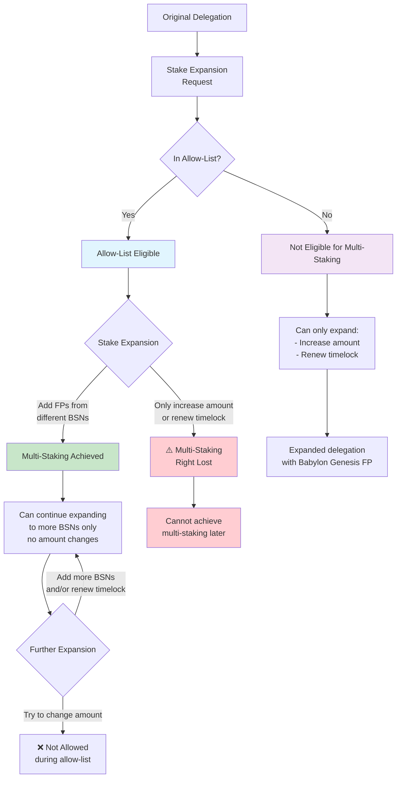

# Multi-Staking Allow List

1. [Introduction](#1-introduction)
2. [Terminology](#2-terminology)
   1. [Multi-Staking](#21-multi-staking)
   2. [Stake Expansion](#22-stake-expansion)
   3. [Multi-Staking Allow-List](#23-multi-staking-allow-list)
3. [Timeline of Events](#3-timeline-of-events)
   1. [Allow-List Activation](#31-allow-list-activation)
   2. [Allow-List Expiration](#32-allow-list-expiration)
4. [Retrieving details about the allow-list](#4-retrieving-details-about-the-allow-list)

## 1. Introduction

This document outlines the multi-staking allow list feature that enables controlled
expansion of existing delegations to multi-staking capabilities. Multi-staking allows
a single delegation to be associated with finality providers from different
Bitcoin Secured Networks (BSNs), accruing rewards from all these.

The allow list is implemented as a temporary mechanism to gradually introduce
multi-staking capabilities while maintaining system stability. During the allow-list
period, multi-staking is only available through stake expansion of existing
delegations, not through new delegation creation.

## 2. Terminology

### 2.1. Multi-Staking

Multi-staking refers to the capability of a single delegation to be associated
with finality providers from multiple Bitcoin Secured Networks (BSNs).
This allows stakers to use the same stake to secure multiple networks
while maintaining a single stake transaction.

### 2.2. Stake Expansion

Stake expansion is the process of modifying an existing delegation to include
additional finality providers from different BSNs, increase the BTC amount staked
and/or renew the staking timelock. This is the
only method to achieve multi-staking during the multi-staking allow-list period.

### 2.3. Multi-Staking Allow-List

The multi-staking allow-list is a collection of staking transaction hashes
that are eligible for expansion to multi-staking capabilities. It has a
pre-determined expiration period and serves as a mechanism to control
the gradual rollout of multi-staking functionality.

During the allow-list period:

- Only delegations with transaction hashes included in the allow-list can expand to multi-staking
- New delegations cannot be created with multi-staking capabilities
- Existing multi-staking delegations can continue to expand (note that for a delegation to be multi-staking, its ancestor transaction must have been in the allow-list)

> **⚡ Note**
> The allow-list will expire at a predefined time/block height. Once it has expired,
> multi-staking capabilities will be available for all delegations, including new ones.

> **⚠️ Warning**
> Stake expansions that only increase the staked amount and/or extend the timelock
> without adding finality providers from different BSNs will not achieve multi-staking.
> The resulting expanded transaction will remain delegated to a single finality provider from Babylon Genesis network.
> Importantly, if the original delegation was in the allow-list, this eligibility
> will be permanently lost as the expanded transaction does not inherit allow-list status.
> This design ensures simple and consistent multi-staking eligibility rules.

See below a flow chart of the possible outcomes
during the multi-staking allow-list period:

## 3. Timeline of Events

### 3.1. Allow-List Activation

When the multi-staking allow-list becomes active, the following rules apply:

**Eligible for Multi-Staking Expansion:**

- Delegations with transaction hashes included in the allow-list
- Delegations that have already expanded to multi-staking
  (its ancestor transaction must have been in the allow-list))

**Multi-Staking Restrictions:**

- New delegations cannot be created with multi-staking capabilities.
  New delegations can **only** stake to a Babylon Genesis finality provider.
- Only stake expansion is permitted to achieve multi-staking
- Multi-staking delegations are not allowed to change the staked amount during the allow-list period
- Expansions must follow existing validation rules and security constraints

> **⚡ Important**
> The criteria for inclusion in the allow-list is to be determined (TBD).
> The specific requirements and selection process will be announced separately.
> The purpose of this document is to describe the mechanics of the allow-list
> and not how it will be populated.

> **⚠️ Warning**
> It is possible to perform a stake expansion without achieving multi-staking
> by **only** increasing the staked amount and/or renewing the timelock.
> In such cases, the resulting expanded transaction will not be multi-staking
> (i.e., it will continue delegating to only a single finality provider).
> If the original delegation
> was within the allow-list, the right for multi-staking will be lost as the
> expanded transaction will not inherit the allow-list eligibility.
> This design choice was made to keep the multi-staking eligibility rules
> simple and avoid adding extra complexity for this edge case.

### 3.2. Allow-List Expiration

Once the allow-list expires, multi-staking becomes fully available:

- All delegations, both existing and new, can utilize multi-staking capabilities
- New delegations can be created with multi-staking from the start
- Stake expansion continues to be available for all delegations
- No restrictions based on transaction hash inclusion

> **⚡ Important**
> The duration of the allow-list period is to be determined (TBD).
> The specific timeframe will be announced prior to activation.

## 4. Retrieving details about the allow-list

To obtain information about the multi-staking allow-list status and included
transaction hashes, you can inspect the relevant code.

**Retrieving Allow-List Transaction Hashes**:
The transaction hashes included in the multi-staking allow-list are hardcoded
in the codebase for each deployed network. The specific location will be
determined based on the implementation approach.
