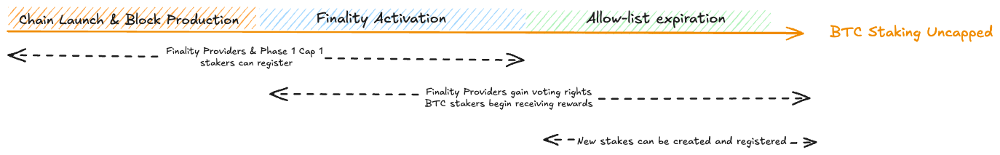

# Staking Registration Eligibility

Table of contents:

1. [Introduction](#1-introduction)  
2. [Timeline of Events](#2-timeline-of-events) 
    1. [Chain launch](#21-chain-launch)
    2. [Allow-list](#22-allow-list)
    3. [Staking protocol and finality activation](#23-staking-protocol-and-finality-activation)
3. [Retrieving details about the timeline](#3-retrieving-details-about-the-timeline)  
4. [FAQs](#4-faqs)

## 1. Introduction  

This document is an overview on the various stages of the Babylon chain launch 
and outlines which actors are eligible to register at each stage. The launch is 
structured into three key phases:

	1. Block production commencement & chain launch
	2. Finality activation
	3. Allow-list expiration

Each stage determines when and how different participants can register.
* **Block production commencement & finality activation**: At this stage, only 
    `Finality providers` and `phase-1 cap-1 stakers` are permitted to register.
    The allow-list enforces restrictions preventing new stakes from being created.
    BTC stakers do not receive voting power or rewards at this point. Only
    post-staking registrations for existing actors are permitted, as reflected 
    in the allow-list.
* **Finality Activation & Allow-list expiration** Finality providers gain 
    voting rights, and BTC stakers begin receiving rewards.
* **Allow-List Expiration & Thereafter**: All stakeholders can register and new
    stakes can be created. BTC Staking is uncapped.

Further details on this process can be found in [Section 2.3: Staking Protocol & Finality Activation](#23-staking-protocol-and-finality-activation).

## 2. Timeline of Events  



### 2.1. Chain launch

The launch process consists of multiple key steps, ensuring that 
**finality providers, validators, and BTC stakers** transition smoothly into
the network:

* **Single Validator Start**: The Babylon Labs validator will produce the first 
    blocks to initiate the network.
* **Gradual Validator Set Expansion**: Validators will register upon launch but
    will not become active until the next epoch.
* **Finality Provider Onboarding**: Finality providers will be able to register
    shortly after launch to prepare for BTC staking finality activation.
* **Controlled Transition of BTC Stakers**: BTC stakers will transition once
    finality is active, ensuring that voting power is correctly distributed.

Since **block production throughput is limited**, onboarding will take place
over multiple blocks to prevent congestion. Additionally, validators can censor transactions, so decentralisation will be achieved gradually by allowing 
multiple validators to produce blocks.

###  2.2. Allow-list

The allow-list consists of staking transactions hashes completed during `cap-1`.
This means that only those that staked during `cap-1` can register when the 
allow-list is active. During this period, only post-staking registrations are 
permitted, specifically during block production and finality activation. 
No pre-staking registrations can take place before the allow-list expires. 

The allow-list will expire at a predefined block height. Once it has expired, 
all stake types, both pre and post-registrations become valid for staking.
 
### 2.3. Staking protocol and finality activation  

There are 2 ways to create stake, through pre-staking registration and 
post-staking registration. 

* **Pre-staking registration**: The process where a staker registers their
    stake with Babylon **before** staking on Bitcoin, without providing a proof 
    of inclusion.
* **Post-staking registration**: The process where a staker **first** stakes on
    Bitcoin and then registers their stake with Babylon.

To see more on this please refer to [Registering Bitcoin Stake](../../../docs/register-bitcoin-stake.md)

Babylon's BTC Staking protocol introduces an additional consensus round, known
as the **finality round**, which occurs after blocks are produced by CometBFT.
This round is conducted by **finality providers**, whose voting power is
derived from staked BTC delegated to them. The [Finality module](https://github.com/babylonlabs-io/babylon/blob/main/x/finality) leverages the voting power table
maintained in the BTC Staking module to determine block finalisation status,
detect equivocations among finality providers, and impose slashing penalties on
BTC delegations under culpable providers.

During the chain launch, finality providers and BTC stakes must transition
through an active Babylon blockchain in a structured sequence. Finality
providers must transition first, as the Babylon blockchain only accepts stake
registrations that delegate to known finality providers. Due to the network’s
limited block throughput, onboarding both finality providers and BTC stakes will
require multiple blocks to complete. Additionally, since CometBFT validators
have the ability to censor specific onboarding transactions, it is essential to
allow sufficient validators to produce blocks.

Additionally, the activation timing will be specified as a special condition on
`x/btcstaking` based on a pre-defined block height.

## 3. Retrieving details about the timeline  
<!-- the below needs to be upated as cannot seem to find the query, i think it needs to be added:  
https://github.com/babylonlabs-io/babylon/issues/321-->

To retrieve information about protocol activation, we can query the BTC Staking
module, where a predefined block height is set for activation.

The allow-list is hardcoded and accessible to all users; however, it is currently
only manageable by querying the genesis file. This is defined by the parameter:

```
`flagAllowedReporterAddresses = "allowed-reporter-addresses"`
```

To query the BTC Staking parameters, use:

`babylond query btcstaking params`

Within the output, look for the `BTCStakingActivatedHeight` field to find the
activation block height.

### 4. FAQs

<!-- TBD -->