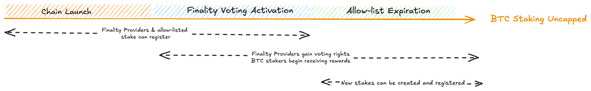

# Staking Registration Eligibility

1. [Introduction](#1-introduction)
2. [Timeline of Events](#2-timeline-of-events)
    1. [Chain launch](#21-chain-launch)
    2. [Allow-list](#22-allow-list)
    3. [Staking protocol and finality activation](#23-staking-protocol-and-finality-activation)
3. [Retrieving details about the timeline](#3-retrieving-details-about-the-timeline)
4. [FAQs](#4-faqs)

## 1. Introduction

This document outlines the various stages of the Babylon chain launch
and details which actors are eligible to register at each stage.
The launch is structured into three key stages:

1. Chain Launch
2. Bitcoin Staking Finality activation
3. Uncapped Bitcoin Staking
<!-- todo improve the name of stage 3 -->

Each stage determines when and how different participants can register.
* **Stage 1: Chain Launch**: At this stage, only
  Finality providers and allow-listed stakes can register.
  The allow-list specifies a list of transaction hashes that
  are eligible for registration. These transaction hashes are
  typically associated with existing transactions (e.g., coming from phase-1).
  The main purpose of the allow-list is to enforce the initial slow onboarding
  of the Bitcoin stake to ensure a smooth launch before BTC staking
  becomes fully permissionless.
  Note that even though stake and finality providers can register,
  they do not have voting power. This comes at the next stage.
* **Stage 2: Bitcoin Staking Finality Activation** Finality providers gain
  voting rights, and BTC stakers begin receiving rewards.
* **Stage 3: Uncapped Bitcoin Staking**: All stakeholders can register and new
  stakes can be created. BTC Staking is uncapped.

Further details on this process can be found
in [Section 2.3: Staking Protocol & Finality Activation](#23-staking-protocol-and-finality-activation).

## 2. Terminology

### 2.1. Bitcoin Stake Registration

Bitcoin stake registration involves the submission of
Bitcoin stakes into the Babylon chain in order for the stake
to receive voting power and earn rewards.

There are 2 ways to create stake, through pre-staking registration and
post-staking registration.

* **Pre-staking registration**: The process where a staker registers their
    stake with Babylon **before** staking on Bitcoin, without providing a proof
    of inclusion.
* **Post-staking registration**: The process where a staker **first** stakes on
    Bitcoin and then registers their stake with Babylon.

To see more on this please refer to [Registering Bitcoin Stake](../../../docs/register-bitcoin-stake.md)

### 2.2. Stakes Allow-List

The allow-list consists of a collection of transaction hashes that correspond
to specific stakes. This list is used to determine which stakes are eligible
for registration. During the active period of the allow-list, **only post-staking**
registrations are allowed, particularly during block production and finality
activation. Pre-staking registrations are not permitted until the allow-list
has expired.

The allow-list will expire at a predefined block height. Once it has expired,
all stake types, both pre-staking and post-staking registrations become
valid for staking.

### 2.3. Finality Voting Activation

Finality voting activation refers to the point in which Finality Providers
are enabled to begin casting votes to finalize blocks on Babylon.
This is determined by a specific block height and once activated, finality
providers can start participating in the finality voting process, and BTC
stakes can be registered and begin earning rewards.

Prior to activation, the security of the Babylon blockchain is maintained by the
CometBFT validators. These validators are responsible for producing blocks and
ensuring the integrity of the blockchain until the BTC Staking protocol is
fully activated.

Due to the limited throughput of the Babylon blockchain and the potential for
transaction censorship by CometBFT validators, onboarding will occur over
multiple blocks to prevent congestion. By setting a specific block height for
activation, the network can ensure that all necessary conditions are met,
facilitating gradual decentralization as more participants join the network.
This special condition is specified as a block height on `x/btcstaking`.

Once finality voting is activated, BTC stakers can start earning rewards
based on their voting power.

## 3. Timeline of Events



### 3.1. Chain Launch

The chain launch procedure involves the Babylon Chain
starting to produce blocks that contain transactions.
At this point, the following actors can start onboarding
into the chain:
* **CometBFT Validators**: CometBFT validators can permissionlessly
  submit validator registration transactions and become eligible
  for producing Babylon blocks. More details on the CometBFT
  validator registration procedure can be found [here](../../../x/epoching).
* **Finality Providers**: Finality providers can permissionlessly
  register into the Babylon chain. Note that finality providers
  that have operated and received delegations in a Phase-1 Babylon
  network, should register using *exactly* the same EOTS key they
  used for the corresponding network
  (i.e., for Babylon chain mainnet use the same key as with the phase-1 mainnet).
  More details on how to register a finality provider or migrate the phase-1
  EOTS key into the Babylon chain can be found
  [here](https://github.com/babylonlabs-io/finality-provider).
* **BTC Stake Registration** Bitcoin stakes for which their hash
  is included in the allow-list and the finality provider to which
  they have been delegated to has registered
  can now register to the Babylon chain.
  More details on how to register your Bitcoin stakes
  [here](../../../docs/register-bitcoin-stake.md).

> **⚡ Important** Bitcoin stakes cannot register to the Babylon chain
> unless the finality provider they have been delegated to has registered.
> For phase-1 stakes, this means that the phase-1 finality providers
> should register first, before stake registration is attempted.

> **⚡ Important** While finality providers and Bitcoin Stakers can
> register at this point, the Bitcoin stake does not yet have voting power
> and is not eligible for receiving rewards. Voting power and rewards
> will start being granted once the finality protocol activates
> (see following sections).

### 3.2. Finality Voting Activation

When finality voting is activated, finality providers can begin
participating in the voting process to finalize blocks, this is essential for
ensuring the security of the chain. This allows them to contribute to the
network's consensus and security. Additionally, BTC staking rewards will be
distributed to stakers based on their voting power. Participants can also
start withdrawing their earned rewards, for those who have staked their BTC.

### 3.3. Allow-list Expiration

Once the allow-list has expired, several capabilities are unlocked for the
actors in the system.
* **Finality providers (FPs)**: can continue their operations as usual,
  maintaining their role in the network without any changes. This includes
  participating in the finality voting process to finalize blocks,
  ensuring the security and immutability of the blockchain.
  Finality providers continue to cast votes, contribute to achieving consensus,
  and secure the network, all while earning rewards based on their voting power.
* **BTC Stakers**: stake registration is now open to all, allowing
  both existing stakes (e.g. from phase-1) and new stakes to be registered.

## 4. Retrieving details about the timeline

To obtain information about the activation block height and the allow-list of
staking transactions, you can query the BTC Staking module or inspect the
relevant code.

**Retrieving the Activation Block Height**
To retrieve the activation block height, query the BTC Staking module
parameters using the following command:

```shell
babylond query btcstaking params
```

In the command output, locate the `BTCStakingActivatedHeight` field, which
indicates the activation block height.

Alternatively, you can find the activation block height defined in the code by
navigating to:

```shell
app/upgrades/v1/mainnet/btcstaking_params.go
```

**Retrieving the Allow-list of Staking Transaction Hashes**
To access the allow-list of staking transaction hashes, refer to
the following file:

```shell
app/upgrades/v1/mainnet/allowed_staking_tx_hashes.go
```

This file contains the list of transaction hashes that are permitted for
BTC staking.

### 5. FAQs

<!-- TBD -->