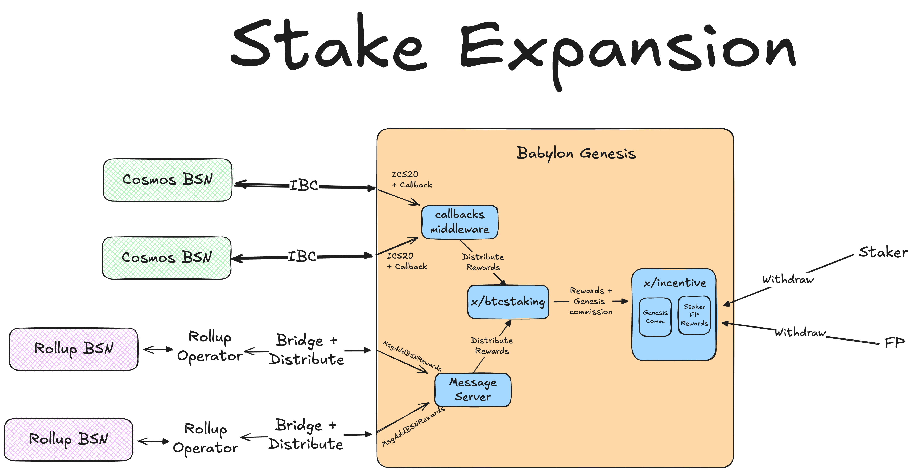

# BSN Rewards Distribution on Babylon Genesis

1. [Introduction](#1-introduction)
    1. [What is BSN Rewards Distribution?](#11-what-is-bsn-rewards-distribution)
    2. [Who Gets Rewards?](#12-who-gets-rewards)
    3. [Key Terminology](#13-key-terminology)
    4. [Rewards Distribution Flow](#14-rewards-distribution-flow)
    5. [Module Overview](#15-module-overview)
2. [Rewards Protocol](#2-rewards-protocol)
    1. [Rewards Distribution Procedure](#21-rewards-distribution-procedure)
    2. [Submitting rewards via transactions](#22-rewards-distribution-via-msgaddbsnrewards)
    3. [Submitting rewards via IBC](#23-rewards-distribution-via-ibc)
    4. [Querying and Withdrawing Rewards](#24-querying-and-withdrawing-rewards)
    5. [Internal Processing Details](#25-internal-processing-details)
3. [BSN Consumer Types](#3-bsn-consumer-types)
    1. [Rollup BSN Consumers](#31-rollup-bsn-consumers)
    2. [Cosmos BSN Consumers](#32-cosmos-bsn-consumers)

## 1. Introduction

The Babylon Genesis chain as the control plane for the BTC Staking protocol,
defines a rewards distribution protocol for
consumer Bitcoin Supercharged Networks (BSNs)
to distribute staking rewards to the BTC Stakers
onboarded and securing them.

The rewards distribution protocol connects three key participants:
1. **BTC stakers** earn rewards proportional to their stake,
2. **finality providers** receive voting power delegations,
   operate the finality signing infrastructure, and
   receive commissions out of all staker rewards,
3. **Babylon Genesis** which takes a commission of reward distributions
   for its service as the control plane. The commission is defined
   upon the time of the BSN's registration.

BSN consumers (Rollups or Cosmos SDK based networks) register with Babylon Genesis to
receive BTC staking security services. They submit rewards through direct
transactions or IBC transfers, which are then distributed among all the
aforementioned participants.

## 2. Rewards Protocol

### 2.1. Rewards Distribution Procedure

The following diagram illustrates how rewards flow through Babylon Genesis.


**Flow Steps:**

1. BSNs allocate rewards to BTC Stakers and submit them through:
   - **Option 1:**: Submission of a Babylon Genesis transaction (`MsgAddBsnRewards`).
     Described in [Section 2.2.](#22-rewards-distribution-via-msgaddbsnrewards)
   - **Option 2:**: An IBC transfer with callback memos.
     Described in [Section 2.3.](#23-rewards-distribution-via-ibc).
2. The Babylon Genesis chain through the `x/btcstaking` module
   processes the rewards and transfers funds to the `x/incentive` module.
3. The Babylon Genesis chain deducts its commission and distributes
   the rewards to the BTC stakers. Distribution happens through a multi-staking
   adaptation of the
   [F1 algorithm](https://drops.dagstuhl.de/storage/01oasics/oasics-vol071-tokenomics2019/OASIcs.Tokenomics.2019.10/OASIcs.Tokenomics.2019.10.pdf).

**Bridging of Rewards:**

All rewards must be native `x/bank` assets on the Babylon Genesis chain.

Since BSNs are expected to distribute their native assets as BTC staking rewards,
these assets need to be bridged to Babylon Genesis.
This can be achieved through any mechanism that results in the creation of
a native `x/bank` asset.

Currently, native `x/bank` assets can be created via:
* ICS-20 transfers using IBC
* Token creation through the `tokenfactory` module.

> **⚠️ Important**: CW-20 assets are *not* supported.**

In [Section 3](#3-bsn-consumer-types),
we will outline the typical methods for different types of BSNs
to distribute their rewards:
* **Cosmos SDK BSNs**: Use ICS-20 transfers and IBC Callbacks.
* **Rollup BSNs**: Bridge assets via available Ethereum-to-Cosmos bridges.

> **🧑‍🎓 Module Architecture:**
>
> The rewards distribution integrates several Babylon modules:
> - **`x/btcstaking`**: Core module managing finality providers, delegations, and reward distribution
> - **`x/incentive`**: Handles the F1 fee distribution algorithm and reward calculation logic.
>   This module already happens the distribution of rewards by Babylon Genesis.
> - **`x/btcstkconsumer`**: Manages BSN consumer registrations and commission rates.
> - **IBC Callback Middleware**: Processes IBC transfers with reward distribution instructions

### 2.2. Rewards distribution via `MsgAddBsnRewards`

BSN rewards can be distributed through the submission of a `MsgAddBsnRewards`
message to the Babylon Genesis chain.

The `MsgAddBsnRewards` message is structured as follows:

```go
type MsgAddBsnRewards struct {
	// Sender is the babylon address which will pay for the rewards
	Sender string `protobuf:"bytes,1,opt,name=sender,proto3" json:"sender,omitempty"`
	// BsnConsumerId is the ID of the BSN consumer
	BsnConsumerId string `protobuf:"bytes,2,opt,name=bsn_consumer_id,json=bsnConsumerId,proto3" json:"bsn_consumer_id,omitempty"`
	// TotalRewards is the total amount of rewards to be distributed among finality providers
	TotalRewards github_com_cosmos_cosmos_sdk_types.Coins `protobuf:"bytes,3,rep,name=total_rewards,json=totalRewards,proto3,castrepeated=github.com/cosmos/cosmos-sdk/types.Coins" json:"total_rewards"`
	// FpRatios is a list of finality providers and their respective reward distribution ratios
	FpRatios []FpRatio `protobuf:"bytes,4,rep,name=fp_ratios,json=fpRatios,proto3" json:"fp_ratios"`
}
```

**Field Explanations:**
- `Sender`: Babylon address (bbn...) that will pay for the rewards.
- `BsnConsumerId`: The unique identifier used for the BSN at the time
  of its registration. IDs that have not been registered to Babylon Genesis
  will not be accepted.
- `TotalRewards`: The total reward amount and its denomination to be distributed
  as part of this operation.
  > **⚡ Important:** Before sending the message, the `Sender` account must have enough
  > coins to cover the amount declared in the `TotalRewards` field.
- `FpRatios`: List mapping finality provider public keys to the portion (as a decimal)
  of the `TotalRewards` that they and their delegators should receive. Notes:
    - All portions should sum up to `1.0`.
    - All finality providers must already be registered on Babylon Genesis and
      have active delegations.

Once received, Babylon Genesis processes the rewards and
distributes them to the BTC stakers, finality providers, and
the Babylon Genesis module address holding the chain's commission.

> **⚡ Important**: The rewards of a finality provider are distributed to
> its delegators based on the active stakes at the time the
> distribution message is submitted.
>
> To minimize the risk of delegators missing rewards,
> especially those who unbond on-demand before a distribution occurs,
> it is recommended to distribute rewards as frequently as is practical.

### 2.3. Rewards distribution via IBC

BSN rewards can be distributed using ICS-20 IBC transfers
with specially formatted memo fields to trigger IBC Callbacks.

ICS-20 transfers are
[well documented](https://github.com/cosmos/ibc/tree/main/spec/app/ics-020-fungible-token-transfer),
so this section is going to focus on the expected
[IBC callbacks](https://github.com/cosmos/ibc-go/blob/main/docs/architecture/adr-008-app-caller-cbs.md)
format.

Specifically, the sender needs to prepare an ICS20 token transfer
to Babylon Genesis, including the reward tokens and a specially
formatted `memo` field that contains the callback instructions for
reward distributions.

The `memo` field should be structured as follows:
```go
// CallbackMemo defines the structure for callback memo in IBC transfers
type CallbackMemo struct {
	Action string `json:"action,omitempty"`
	DestCallback *CallbackInfo `json:"dest_callback,omitempty"`
}

// CallbackInfo contains the callback information
type CallbackInfo struct {
	Address string `json:"address"`
	AddBsnRewards *CallbackAddBsnRewards `json:"add_bsn_rewards,omitempty"`
}

// CallbackAddBsnRewards specifies BSN reward distribution parameters
type CallbackAddBsnRewards struct {
	BsnConsumerID string `json:"bsn_consumer_id"`
	FpRatios []FpRatio `json:"fp_ratios"`
}
```

**Field Explanations:**
- `Action`: Must be set to `"add_bsn_rewards"` to trigger reward distribution
- `Address`: Required field for callback mechanism (can be placeholder)
- `BsnConsumerID`: Identifies which BSN consumer the rewards are for
- `FpRatios`: Specifies reward distribution ratios among finality providers

Upon the creation of the full ICS20 transfer and the
appropriately constructed `memo` field,
the IBC transfer can be executed.
Upon execution,
the IBC callbacks functionality on Babylon Genesis
will parse the `memo` field and
trigger the `AddBsnRewards` functionality
described in [Section 2.5.](#25-internal-processing-details).

> **⚡ Important:**
> IBC-based reward distribution follows the same validation rules and processing
> logic as direct `MsgAddBsnRewards` transactions, ensuring consistent
> behavior across both submission methods.

### 2.4. Querying and Withdrawing Rewards

The `x/btcstaking` module manages BSN rewards by transferring funds to the
`x/incentive` module, which handles reward distribution and
provides methods for querying and withdrawing available rewards.

The rewards distribution leverages the existing incentive module infrastructure
that has been in use for the distribution of Babylon Genesis BTC Staking rewards.
Specifically, it provides methods for:
- Rewards gauge management
- Historical reward tracking
- Withdrawal

For more details on the withdrawal of multi-staking rewards
please refer to the [`x/incentive` module documentation](../../incentive/README.md)

### 2.5. Internal Processing Details

Both the transaction initiated and the IBC callbacks initiated
transfers lead to the usage of the `AddBsnRewards` function.
This function is responsible for coordinating the entire reward distribution
process.

**Core Processing Steps:**
1. Validates sender balance and finality provider registrations
2. Deducts Babylon Genesis commission based on the consumer's registered rate.
   The commission is calculated based on the commission defined upon
   the BSN's registration and is transfered to the `commission_collector_bsn`
   module account.
3. Transfers rewards to the `incentive` module for processing.

> **⚡ Important:** BSN consumers determine their own `FpRatios` 
> calculation logic - Babylon Genesis does not enforce any specific distribution 
> methodology.

## 3. BSN Consumer Types

BSN consumers can be implemented as either rollup-based or Cosmos SDK-based 
chains, each with different reward submission mechanisms:

| Aspect               | Rollup BSN Consumer    | Cosmos BSN Consumer                  |
| -------------------- | ---------------------- | ------------------------------------ |
| Reward submission    | `MsgAddBsnRewards` tx  | IBC Transfer + memo                  |
| Bridge requirement   | External bridge needed | Native IBC transport + Callbacks     |

### 3.1. Rollup BSN Consumers

Ethereum-based Rollup BSNs that intend to distribute an Ethereum based token
as a reward to BTC stakers must use bridging infrastructure to create
a native bridged denomination of the token on Babylon Genesis.
The native denomination can then be distributed using `MsgAddBsnRewards`
as described in [Section 2.2.](#22-rewards-distribution-via-msgaddbsnrewards).

### 3.2. Cosmos BSN Consumers

Cosmos SDK-based BSN consumers are expected to use IBC transfers
combined with IBC Callbacks. Specifically,
the Cosmos BSNs stack can periodically generate an ICS-20 transfer
containing the details of the distribution as part of an IBC Callback
message in the `memo` field.

Here's an example memo field:
```json
{
  "action": "add_bsn_rewards",
  "dest_callback": {
    "address": "bbn1a2cghwg94u6n5qpjahecv7rtdn0ygx8ugqf46e",
    "add_bsn_rewards": {
      "bsn_consumer_id": "07-tendermint-0",
      "fp_ratios": [
        {
          "btc_pk": "04d4436af9ab1cebd15296cd68ecdb20e48b9c190df4eed1cb3c0a2cf45514d9",
          "ratio": "0.700000000000000000"
        },
        {
          "btc_pk": "4ced6bba09417a58d14fb68528f27c8d25318a5c9e4b1af95415b2a4554403a2",
          "ratio": "0.300000000000000000"
        }
      ]
    }
  }
}
```

The entire amount sent with the ICS20 transfer will be used as rewards for 
distribution, processed through the same reward distribution system as direct 
transactions.