# CoStaking Module

The CoStaking module enables users to earn aditional rewards by simultaneously
stake both Bitcoin (BTC) and Baby tokens. This module tracks "costakers" who
have delegations in both systems.

## Quick Start

A **costaker** is a user who has:
1. **BTC delegations**: Active delegations to active finality providers via the
`x/btcstaking` module
2. **Baby delegations**: Active delegations to validators via cosmos `x/staking`

The module dynamically tracks and updates costaker positions based on
delegation state changes through a comprehensive hook system.

## Key Components

### CostakerRewardsTracker

The core data structure tracking each costaker's position:

```go
// CostakerRewardsTracker represents the structure that holds information
// from the last time this staker withdraw the costaking rewards or modified
// his active staked amount of baby or satoshis.
// The babylon address of the staker is ommitted here but should be part of the
// key used to store this structure.
// Key: Prefix + costaker babylon address.
type CostakerRewardsTracker struct {
  // StartPeriodCumulativeReward the starting period the costaker
  // made his last withdraw of costaking rewards or modified his active staking
  // amount of satoshis or baby.
  StartPeriodCumulativeReward uint64 `protobuf:"varint,1,opt,name=start_period_cumulative_reward,json=startPeriodCumulativeReward,proto3" json:"start_period_cumulative_reward,omitempty"`
  // ActiveSatoshis is the total amount of active satoshi delegated
  // from this costaker babylon address.
  ActiveSatoshis cosmossdk_io_math.Int `protobuf:"bytes,2,opt,name=active_satoshis,json=activeSatoshis,proto3,customtype=cosmossdk.io/math.Int" json:"active_satoshis"`
  // ActiveBaby is the total amount of active baby delegated
  // from this costaker babylon address.
  ActiveBaby cosmossdk_io_math.Int `protobuf:"bytes,3,opt,name=active_baby,json=activeBaby,proto3,customtype=cosmossdk.io/math.Int" json:"active_baby"`
  // TotalScore is the total amount of calculated score
  // of this costaker.
  TotalScore cosmossdk_io_math.Int `protobuf:"bytes,4,opt,name=total_score,json=totalScore,proto3,customtype=cosmossdk.io/math.Int" json:"total_score"`
}
```

### Hook System

The module responds to events from three other modules:

- **x/finality**: BTC delegation and finality providers lifecycle events
- **x/staking**: Baby token delegation changes
- **x/incentive**: Triggers rewards withdraw

## Costaker State Logic

```mermaid
graph TD
    A[Costaker] --> B{Has BTC<br>Delegations?}
    A --> C{Has Baby<br>Delegations?}

    B -->|Yes| D[BTC: hooks <br>x/finality]
    B -->|No| X[❌]

    C -->|No| X[❌]
    C -->|Yes| F[Baby: hooks <br>x/staking]

    D --> J[🎯 CoStaker State<br/>Tracked by x/costaking]
    F --> J

    J --> M[CostakerRewardsTracker<br/>ActiveSatoshis + ActiveBaby + TotalScore]
    J --> N[Eligible for costaker rewards]

    style J fill:#e8f5e8,stroke:#4caf50,stroke-width:3px
    style M fill:#f3e5f5
    style N fill:#e1f5fe
```



## Hook Interactions

### x/finality Hooks

- `AfterBtcDelegationActivated`: Adds satoshis to costaker if the chosen fp was
in the active set.
- `AfterBtcDelegationUnbonded`: Removes satoshis from costaker if the chosen fp was active
in the previous babylon block.
- `AfterBbnFpEntersActiveSet`: Iterates over all the BTC delegations made for this fp and
add satoshi to the costaker structure.
- `AfterBbnFpRemovedFromActiveSet`: Iterates over all the BTC delegations made for this fp and
removes satoshi in the costaker structure.


### x/staking Hooks

- `BeforeDelegationSharesModified`: Stores the amount of baby staked for that
  validator in a map in memory to calculate the delta change.
- `AfterDelegationModified`: Updates Baby token amount based on delegation
  delta change using the in memory cache.


### x/incentive Hooks

- `BeforeRewardWithdraw`: Calculates and transfers the appropriate reward amounts from the
costaking module account to the incentive module account before reward distribution.


